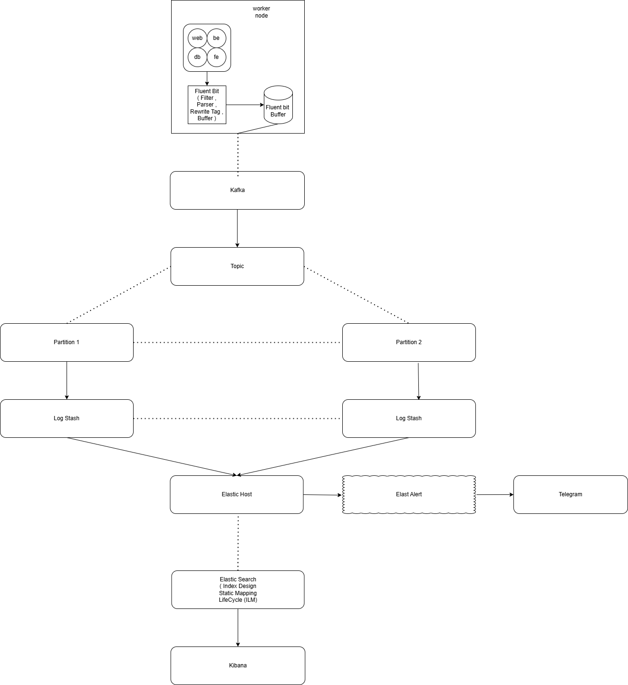

# Báo Cáo Nghiên Cứu và Triển Khai Hệ Thống Log Tập Trung, Log Search trên Kubernetes

## 1. Tổng Quan Kiến Trúc Logging
Mặc định, nền tảng Kubernetes không cung cấp cơ chế lưu trữ nhật ký (log) dài hạn. Dữ liệu log của ứng dụng thường được các Container Runtime (như Containerd) ghi nhận dưới dạng tệp tin cục bộ tại đường dẫn `/var/log/pods/` trên từng Node. Với đặc tính vòng đời vô thường (ephemeral) của Pod, dữ liệu log cục bộ này sẽ bị xóa bỏ hoàn toàn khi Pod khởi động lại hoặc bị thu hồi.

Nhằm khắc phục triệt để hạn chế này, kiến trúc tiêu chuẩn được áp dụng là mô hình **Node-level Logging Agent**.
Cơ chế cốt lõi bao gồm:
- Triển khai một tiến trình thu thập (Agent) dưới dạng DaemonSet trên toàn bộ các Node thuộc cụm.
- Agent đảm nhiệm việc thu thập và tổng hợp dữ liệu log phát sinh từ các luồng chuẩn (`stdout/stderr`) của Container.
- Làm giàu dữ liệu (Data Enrichment) bằng cách đính kèm các siêu dữ liệu (Metadata) quan trọng của Kubernetes như: Tên Pod, Tên Namespace, và Nhãn (Labels) vào từng bản ghi log.
- Chuyển tiếp toàn bộ sự kiện về hệ thống xử lý và lưu trữ tập trung (Log Backend) nhằm phục vụ công tác phân tích, lập chỉ mục và tìm kiếm.



## 2. Giải Pháp Quy Hoạch & Thiết Kế Kiến Trúc
Hiện trạng hệ thống Kubernetes đang triển khai kiến trúc lưu trữ **Elasticsearch** và giao diện trực quan hóa **Kibana** (thuộc hệ sinh thái ELK) tại không gian định danh (namespace) `elk-dung` (một số thành phần có thể tham chiếu qua namespace `elk`).

Nhằm đáp ứng tiêu chuẩn vận hành thực tế (Production-grade) và đảm bảo tính chịu lỗi cao (Fault-Tolerance), giải pháp kiến trúc đã tích hợp thêm hệ thống trung gian phân tải **Apache Kafka** và bộ tiền xử lý **Logstash**, song song với tác tử thu thập tại nguồn **Fluent Bit**.

**Kiến trúc luồng xử lý dữ liệu (Production Log Pipeline):**

```text
  [ Nguồn Phát Sinh Dữ Liệu 1: Môi trường Ứng dụng (dung-lab) ]
  ┌─────────────────────────────────────────────────────────┐
  │  1a. Các Dịch vụ Vi mô Mô phỏng (Microservices Pods)    │
  │  [Frontend]   [Backend]   [Database]   [Webserver]      │
  │         │           │          │             │          │
  │         ▼ Xuất log JSON qua stdout/stderr               │
  │  2a. /var/log/containers/*.log                          │
  └─────────┬───────────────────────────────────────────────┘
            │
  [ Nguồn Phát Sinh Dữ Liệu 2: Tầng Hạ Tầng (Node wk03) ]
  ┌─────────▼───────────────────────────────────────────────┐
  │  1b. Các Dịch vụ Cốt lõi (Core Services & System)       │
  │  [Cilium Envoy]     [Cinder CSI]     [K8s Events]       │
  │         │                │                 │            │
  │         ▼ Xuất log phi cấu trúc & Sự kiện cụm           │
  │  2b. /var/log/containers/*.log & Kube API               │
  └─────────┬───────────────────────────────────────────────┘
            │
            ▼ Đọc và chuyển tiếp file log liên tục (Tail)
  [ DaemonSet: Fluent Bit - Tác tử Thu thập (Namespace: elk-dung) ]
  ┌─────────▼───────────────────────────────────────────────┐
  │  3. Gắn siêu dữ liệu Kubernetes (Pod, Namespace...)     │
  │     Truyền tải định tuyến nhẹ (Lightweight Forwarding)  │
  └─────────┼───────────────────────────────────────────────┘
            │ 
            ▼ Truyền tải luồng sự kiện liên tục
  [ Message Broker: Cụm Kafka (Namespace: kafka-dung) ]
  ┌─────────▼───────────────────────────────────────────────┐
  │  4. Phân tách tải trọng & Bộ đệm thông lượng cao        │
  │     Topic: dung-logs-topic                              │
  └─────────┼───────────────────────────────────────────────┘
            │ 
            ▼ Tiêu thụ dữ liệu theo mô hình Consumer
  [ Deployment: Logstash - Bộ Tiền xử lý (Namespace: elk-dung) ]
  ┌─────────▼───────────────────────────────────────────────┐
  │  5. Xử lý & Phân luồng logic chuyên sâu                 │
  │   ├─ Filter (Ruby): Chuẩn hóa cấu trúc và nội dung      │
  │   └─ Định tuyến Index dựa trên nhãn K8s và Dịch vụ      │
  └─────────┼───────────────────────────────────────────────┘
            │ 
            ▼ Đẩy dữ liệu qua giao thức HTTP Bulk (Port 9200)
  [ Namespace: elk-dung - Trung tâm Lưu trữ, Phân tích & Cảnh báo ]
  ┌─────────▼───────────────────────────────────────────────┐
  │  6. Elasticsearch (Lưu trữ và Lập chỉ mục)              │
  │   ├─ Kiến trúc Index: dung-fe-*, dung-be-*...           │
  │   ├─ Mapping Tĩnh: Kiểm soát chặt chẽ kiểu dữ liệu      │
  │   └─ ILM: Tự động luân chuyển và quản lý vòng đời log   │
  │         │                                 │             │
  │         ▼ Truy vấn & Phân tích            ▼ Quét lỗi    │
  │  7. Kibana Dashboard                8. ElastAlert       │
  └─────────┼─────────────────────────────────┼─────────────┘
            │                                 │
            ▼ Giao diện: 5601                 ▼ Webhook API
   [ Cổng Quản Trị Kỹ Sư ]           [ Kênh Cảnh Báo Telegram ]
```

1. **Nguồn Sinh Log (Log Generators):** Các dịch vụ vi mô độc lập liên tục phát sinh dữ liệu log dưới định dạng chuẩn JSON.
2. **Thu Thập Dữ Liệu (Fluent Bit):** Đóng vai trò là tác tử thu thập gọn nhẹ (Lightweight Shipper), thực hiện trích xuất dữ liệu, gán siêu dữ liệu K8s và chuyển tiếp sự kiện trực tiếp tới cụm Kafka.
3. **Môi Giới Thông Điệp (Kafka):** Đóng vai trò là hệ thống đệm thông lượng cao, cung cấp cơ chế phân tách luồng dữ liệu (Decoupling) và đảm bảo tính toàn vẹn (Fault-Tolerance) trong trường hợp hệ thống Backend gặp gián đoạn.
4. **Tiền Xử Lý Trung Tâm (Logstash):** Tiêu thụ dữ liệu từ Kafka, áp dụng các bộ quy tắc lọc phức tạp (Ruby filters, mutate) để chuẩn hóa cấu trúc JSON trước khi định tuyến sự kiện vào chính xác các Chỉ mục (Index) đích.
5. **Lưu Trữ Tập Trung (Elasticsearch):** Tiếp nhận và lưu trữ dữ liệu vào các Index được phân tách độc lập theo dịch vụ. Áp dụng quy tắc Mapping tĩnh và tự động hóa quản lý vòng đời dữ liệu thông qua Index Lifecycle Management (ILM) để tối ưu hóa tài nguyên.
6. **Trực Quan Hóa (Kibana):** Cung cấp giao diện đồ họa cho phép kỹ sư vận hành thực hiện truy vấn, khai phá và phân tích khối lượng dữ liệu lớn một cách hệ thống.
7. **Cảnh Báo Tự Động (ElastAlert):** Dịch vụ độc lập giám sát luồng dữ liệu theo thời gian thực dựa trên các bộ quy tắc định trước, tự động kích hoạt thông báo (Alerts) đến nhóm vận hành qua các kênh giao tiếp (Telegram).

## 3. Nguồn Phát Sinh Dữ Liệu: Ứng Dụng Mô Phỏng & Hệ Thống Hạ Tầng (Node Logs)
Nhằm phục vụ công tác đo lường hiệu năng, kiểm thử khả năng chịu tải và đánh giá tính chính xác của toàn bộ luồng ống dẫn dữ liệu (Data Pipeline), dự án đã quy hoạch hai nhóm nguồn dữ liệu cốt lõi: Log ứng dụng và Log hạ tầng.

### 3.1 Nhóm Ứng Dụng Mô Phỏng (Microservices)
Hệ thống mô phỏng được phân lập tại namespace `dung-lab`, bao gồm 4 thành phần dịch vụ mô phỏng kiến trúc điển hình:
- **Frontend (FE):** Giả lập nhật ký tương tác người dùng, truy xuất hành vi truy cập trang và thao tác giao diện định kỳ.
- **Backend (BE):** Thực thi kịch bản phản hồi API giả lập, chủ động tạo ra các mã lỗi HTTP tiêu chuẩn (như `500 Internal Server Error`, `400 Bad Request`) nhằm kiểm định cơ chế cảnh báo tự động.
- **Database (DB):** Phát sinh dữ liệu phản ánh trạng thái truy vấn SQL, chủ động ghi nhận các truy vấn chậm (`slow_query`) và sự kiện lỗi xác thực (`auth_failed`).
- **Webserver:** Giả lập cổng giao tiếp Proxy (Nginx), liên tục sinh ra các bản ghi truy cập (access log) và lỗi (error log) theo định dạng tiêu chuẩn.

Các dịch vụ này được cấu hình xuất log qua `stdout` dưới dạng JSON. Cấu trúc ứng dụng được thiết kế tối giản thông qua các đối tượng `ConfigMap` chứa kịch bản Python và các `Deployment` phân bổ tài nguyên tinh gọn.

### 3.2 Nhóm Hạ Tầng & Dịch Vụ Cốt Lõi (Node wk03 Logs)
Bên cạnh log ứng dụng, đường ống dữ liệu còn đảm nhiệm việc quan trắc chuyên sâu tầng hạ tầng, cụ thể là thu thập nhật ký hoạt động từ Node `wk03` (Worker Node). Các thành phần hệ thống được giám sát bao gồm:
- **System Logs:** Ghi nhận các sự kiện hoạt động chung của hệ điều hành và dịch vụ cấp thấp trên Node.
- **Dịch vụ Mạng (Cilium & Envoy):** Truy xuất log luồng truy cập và giám sát chính sách mạng (Network Policies) từ CNI Cilium cùng Envoy Proxy.
- **Dịch vụ Lưu trữ (Cinder CSI Nodeplugin):** Giám sát các tiến trình quản lý, cấp phát và mount phân vùng lưu trữ (Persistent Volumes) thông qua OpenStack Cinder CSI.
- **Sự Kiện Cụm (K8s Events):** Thu thập toàn cục các sự kiện thay đổi trạng thái của Cluster (lập lịch Pod, cảnh báo tài nguyên, v.v.) liên quan đến Node.

## 4. Thiết Kế Tối Ưu Hóa Hệ Thống Lưu Trữ
Trong môi trường vận hành thực tế, hệ thống lưu trữ cần được quy hoạch bài bản nhằm ngăn chặn rủi ro cạn kiệt tài nguyên máy chủ và suy giảm hiệu năng truy vấn. Các chiến lược tối ưu hóa sau đây đã được áp dụng:

### 4.1 Thiết Kế Phân Mảnh Chỉ Mục (Index Design)
Thay vì tập trung toàn bộ dữ liệu log vào một chỉ mục cồng kềnh (ví dụ: `fluent-bit-*`), hệ thống áp dụng chiến lược phân tách Index nghiêm ngặt dựa trên định danh của từng phân hệ dịch vụ:

**Nhóm Chỉ mục Ứng dụng:**
- Dữ liệu Frontend: `dung-fe-write`
- Dữ liệu Backend: `dung-be-write`
- Dữ liệu Database: `dung-db-write`
- Dữ liệu Webserver: `dung-web-write`

**Nhóm Chỉ mục Hạ tầng (Node wk03):**
- Dữ liệu Hệ thống: `wk03-logs-write`
- Dữ liệu Mạng lưới: `wk03-cilium-write`, `wk03-cilium-envoy-write`
- Dữ liệu Lưu trữ: `wk03-cinder-csi-nodeplugin-write`
- Sự kiện Kubernetes: `wk03-k8s-events-write`

Chiến lược này cung cấp khả năng quản trị phân mảnh vượt trội: Cho phép áp dụng linh hoạt các chính sách vòng đời (Retention Policies) riêng biệt. Ví dụ: Log hệ thống có thể cần lưu trữ dài hạn để thanh tra, trong khi Log truy cập Webserver có thể xóa sớm hơn. Đồng thời, kiến trúc này cải thiện đáng kể tốc độ truy vấn trên Elasticsearch khi hệ thống chỉ cần rà soát trên một tập dữ liệu chuyên biệt (ví dụ: chỉ tìm kiếm trong Index Backend) thay vì quét toàn bộ dữ liệu hỗn hợp.

### 4.2 Thiết Lập Ánh Xạ Tĩnh (Static Mapping)
Cơ chế tự động định nghĩa kiểu dữ liệu (Dynamic Mapping) của Elasticsearch, vốn tiềm ẩn rủi ro về sai lệch cấu trúc dữ liệu và lãng phí tài nguyên, đã được vô hiệu hóa hoàn toàn (`dynamic: false`). Hệ thống thực thi cơ chế **Mapping tĩnh**, yêu cầu định nghĩa trước một cấu trúc khuôn mẫu nghiêm ngặt cho dữ liệu đầu vào:
- Trường thời gian `@timestamp` được ép kiểu dữ liệu chuẩn (`date`).
- Các trường siêu dữ liệu dùng cho phân loại, định danh và chỉ báo (ví dụ: `level`, `service`) được quy định dưới dạng tối ưu cho tìm kiếm chính xác (`keyword`).
- Các trường chứa văn bản thông báo chi tiết (`message`) được quy định dưới dạng tìm kiếm toàn văn tự do (`text`).

Phương pháp này thiết lập một cơ chế kiểm duyệt cấu trúc chặt chẽ, từ chối hoặc loại bỏ các dữ liệu rác không tuân thủ mẫu JSON tiêu chuẩn, góp phần tiết kiệm đáng kể năng lực xử lý (CPU) và bộ nhớ (RAM) của cụm Elasticsearch.

### 4.3 Quản Trị Vòng Đời Dữ Liệu Tự Động (Index Lifecycle Management - ILM)
Để giải quyết bài toán gia tăng dung lượng không kiểm soát dẫn đến cạn kiệt đĩa cứng, hệ thống triển khai hai chính sách quản trị vòng đời **Index Lifecycle Management (ILM)** phân tách theo đặc thù dữ liệu:

**1. Chính sách tiêu chuẩn (`logs-lab-policy`):**
Áp dụng cho toàn bộ log ứng dụng mô phỏng và phần lớn log hạ tầng (Mạng, Lưu trữ, Sự kiện). Chính sách này tự động hóa việc luân chuyển dữ liệu qua hai giai đoạn:
- **Giai đoạn Hot:** Xử lý luồng dữ liệu tiếp nhận liên tục. Tiến trình luân chuyển (`rollover`) sẽ tự động vô hiệu hóa quyền ghi của Index hiện tại và khởi tạo Index mới khi đạt ngưỡng `1 ngày` tồn tại, hoặc kích thước lưu trữ chạm `5GB`.
- **Giai đoạn Delete:** Cơ chế dọn dẹp hệ thống được kích hoạt tự động để xóa bỏ hoàn toàn các Index có tuổi thọ tính từ lúc luân chuyển vượt quá `2 ngày`, đảm bảo thu hồi không gian lưu trữ kịp thời.

**2. Chính sách rút gọn (`logs-delete-only-policy`):**
Áp dụng chuyên biệt cho log hệ thống chung của Node (`wk03-logs-*`), vốn có lưu lượng phát sinh lớn nhưng giá trị phân tích chỉ mang tính tức thời (ngắn hạn).
- Không áp dụng cơ chế luân chuyển (`rollover`) phức tạp.
- **Giai đoạn Delete:** Lập tức xóa bỏ dữ liệu khi tuổi thọ vượt quá `1 ngày`, giải phóng tối đa tài nguyên đĩa cứng cho hệ thống.

## 5. Kiến Trúc Đường Ống Xử Lý Dữ Liệu (Data Pipeline)
Trong kiến trúc hiện tại, luồng dữ liệu được xử lý qua hai giai đoạn chuyên biệt: Tác tử thu thập tại nguồn (Fluent Bit) và Bộ xử lý trung tâm (Logstash).

### 5.1 Tác Tử Thu Thập & Chuẩn Bị Dữ Liệu (Fluent Bit)
Tác tử Fluent Bit (`fluent-bit-values.yaml`) đóng vai trò là lớp phòng thủ và chuẩn bị dữ liệu đầu tiên:
- **Quy Trình Lọc Đa Lớp (Multi-layer Filtering):** 
  - Tự động tra cứu và đính kèm các tham số định danh hạ tầng Kubernetes (Tên Pod, IP, Node).
  - Phân tích cú pháp sơ bộ (parsing) văn bản thô thành định dạng JSON tiêu chuẩn.
  - Phân luồng sự kiện ở cấp độ mạng thông qua cơ chế Rewrite Tag.
- **Cơ Chế Đệm An Toàn (Buffer Mechanism):** Thiết lập ngưỡng đệm bộ nhớ cứng (Memory Buffer - `10MB`) để chống tràn RAM cục bộ (OOM) tại Node và sử dụng phân vùng đĩa vật lý (Filesystem Buffer) để lưu trữ an toàn sự kiện khi mất kết nối mạng.

### 5.2 Bộ Xử Lý Chuyên Sâu & Định Tuyến (Logstash)
Đóng vai trò là "trái tim" xử lý logic của kiến trúc, cụm Logstash (`logstash-values.yaml`) tiêu thụ dữ liệu từ Kafka và thực thi các khối lượng công việc phức tạp trước khi ghi vào Elasticsearch:
- **Phân Tích Cú Pháp Chuyên Sâu (Complex Parsing):** Khai thác sức mạnh của các bộ lọc `grok`, `dissect`, `kv`, và `ruby` script để mổ xẻ các dòng log phi cấu trúc cực kỳ dị biệt từ tầng hạ tầng (Ví dụ: bóc tách chính xác từng biến số từ log mạng lưới *Cilium/Envoy* hay các luồng tiến trình lưu trữ của *Cinder CSI Nodeplugin*).
- **Chuẩn Hóa Sự Kiện K8s (Events Normalization):** Tái cấu trúc các đối tượng sự kiện tĩnh của Kubernetes (Event Object) thành các bản ghi Log phẳng với các metadata rõ ràng như `k8s_event_type` và `k8s_event_reason`, phục vụ trực tiếp làm nguyên liệu cho hệ thống Alerting.
- **Định Tuyến Động (Dynamic Routing):** Tự động phân tích các biến nội tại (`namespace`, `pod_name`) của từng bản ghi để gán nhãn đích (`[@metadata][route_target]`), qua đó phân luồng sự kiện một cách thông minh đẩy thẳng vào các Index vật lý độc lập (như `dung-fe-write`, `wk03-k8s-events-write`) thay vì ghi gộp tập trung.

## 6. Hệ Thống Cảnh Báo Chủ Động (Alerting)
Nhằm tự động hóa quy trình giám sát sự cố, dự án đã tích hợp công cụ **ElastAlert** kết nối trực tiếp với cụm Elasticsearch, liên tục đánh giá các mẫu dữ liệu dựa trên hệ thống tệp luật đa dạng (`elastalert-rules-configmap`). Hệ thống cảnh báo được phân cấp rõ ràng theo hai mức độ nghiêm trọng: `[WARNING]` (Cảnh báo sớm, cần kiểm tra) và `[CRITICAL]` (Nghiêm trọng, cần xử lý ngay lập tức).

### 6.1 Các Kịch Bản Cảnh Báo Tiêu Biểu
- **Giám Sát Tần Suất Lỗi Ứng Dụng (Frequency Rules):** Kích hoạt báo động `[WARNING]` khi các chỉ báo rủi ro tăng vọt. Ví dụ: Webserver trả về hơn 20 lỗi `500` trong 5 phút; Backend ghi nhận nhiều lỗi; hoặc sự kiện từ chối xác thực Database gia tăng bất thường (dấu hiệu của các cuộc tấn công dò quét bảo mật).
- **Giám Sát Rủi Ro Hạ Tầng & Hệ Sinh Thái Kubernetes:** Cảnh báo `[CRITICAL]` ngay lập tức khi phát hiện lỗi chí mạng từ cấp độ Node `wk03` (như sự kiện *Out of memory* hoặc *No space left on device*). Đồng thời, ElastAlert được cấu hình để quét chéo dữ liệu Kubernetes Events, nhằm "bắt nóng" các sự cố sập Pod (ví dụ: *Readiness/Liveness probe failed*, *CrashLoopBackOff*).
- **Phát Hiện Điểm Mù (Silence/Flatline Detection):** Áp dụng rule `Flatline` để giám sát sức sống (vitality) của ứng dụng. Điển hình, nếu Backend không đẩy bất kỳ dòng log nào về Elasticsearch trong vòng 15 phút, hệ thống sẽ phát cảnh báo `[CRITICAL]` báo hiệu nguy cơ gián đoạn đường truyền hoặc sập dịch vụ toàn diện.

### 6.2 Cơ Chế Phản Hồi Tức Thời (Real-time Notification)
Thay vì sử dụng Email hay Console tĩnh, toàn bộ các tín hiệu báo động được định tuyến trực tiếp thông qua **Telegram Bot API**. Bằng việc liên kết với các mã Bot Token và Chat ID chuyên biệt, mọi cảnh báo từ lỗi ứng dụng, sập Pod K8s cho tới quá tải ổ cứng đều được đẩy thẳng (Real-time Push) vào thiết bị di động của đội ngũ vận hành. Việc phân tách các con Bot cảnh báo riêng biệt (Log Alert Bot vs Metric Alert Bot) cũng góp phần chuẩn hóa quy trình tiếp nhận thông tin, tối ưu hóa thời gian phục hồi sự cố (MTTR) trong môi trường Production.

**Minh họa thực tế các luồng cảnh báo trên kênh Telegram của đội ngũ vận hành:**


## 7. Tiện Ích Giao Diện và Phân Tích Log (Kibana)
Hệ sinh thái Kibana cung cấp nền tảng toàn diện cho việc khai thác dữ liệu đã được lập chỉ mục trên Elasticsearch.

### 7.1 Cấu Hình Ánh Xạ Dữ Liệu (Data View Configuration)
1. Truy cập trực tiếp vào hệ thống quản trị Kibana thông qua tên miền Ingress: `http://kibana-dung.vnpost.cloud` (hoặc `https://` nếu đã cấu hình SSL).
2. Điều hướng đến phân hệ quản trị hệ thống: **Management** -> **Stack Management**.
3. Truy cập danh mục **Data Views** (trước đây là Index Patterns).
4. Khởi tạo Data View mới với định dạng truy vấn phù hợp (Ví dụ: `dung-be-*` để cấu hình vùng nhìn riêng cho dịch vụ Backend).
5. Định cấu hình trường thời gian mặc định tham chiếu đến trường `@timestamp`.

### 7.2 Thực Thi Truy Vấn và Phân Tích (Discover)
Quy trình truy vấn, sàng lọc dữ liệu log:
1. Chuyển đổi không gian làm việc sang phân hệ **Analytics** -> **Discover**.
2. Xác nhận Data View hiện hành đang trỏ đúng tập dữ liệu mục tiêu tại menu thả xuống.
3. Ứng dụng ngôn ngữ truy vấn KQL (Kibana Query Language) để thực thi bộ lọc đa điều kiện. Cú pháp mẫu nhằm theo dõi lỗi dịch vụ mạng:
   `service: "webserver" AND status_code >= 500`
4. Dựa trên biểu đồ phân bổ thời gian (Histogram) để đánh giá quy mô và xu hướng phát sinh của sự kiện lỗi.

## 8. Quy Trình Vận Hành, Giám Sát và Định Hướng Mở Rộng

### 8.1 Giám Sát Tình Trạng Hệ Thống Tự Động (Health Automation)
Để đảm bảo toàn bộ 5 lớp của kiến trúc hạ tầng (Fluent Bit, Kafka, Logstash, Elasticsearch, Kibana/ElastAlert) vận hành ổn định, dự án đã phát triển bộ công cụ rà soát tự động thông qua PowerShell (`check-logging-health.ps1`). Khi được kích hoạt, hệ thống cung cấp báo cáo theo thời gian thực (Real-time Report) về tình trạng các Pod, độ trễ xử lý thông điệp của Kafka (Consumer Group Lag), và trạng thái Cluster của Elasticsearch.
Đồng thời, kịch bản khởi tạo `setup-es-logging.ps1` được sử dụng để tự động hóa hoàn toàn quy trình phân bổ Index Template và thiết lập các chính sách vòng đời ILM, loại bỏ sự phụ thuộc vào các thao tác cấu hình thủ công dễ gây sai sót.

### 8.2 Quy Hoạch Phân Lập Môi Trường Phân Tích
Nhằm tối ưu hóa hiệu năng và tránh ảnh hưởng tới không gian làm việc mặc định, dự án quy hoạch triển khai một cụm Kibana độc lập chuyên biệt cho mục đích quản trị log (cấu hình qua `kibana-logging-values.yaml`). Hệ thống đã được định tuyến qua Ingress với tên miền `kibana-dung.vnpost.cloud`, giúp thao tác truy xuất mượt mà hơn và loại bỏ hoàn toàn sự phụ thuộc vào các lệnh `port-forward` thủ công. Để bảo vệ tính toàn vẹn của phiên đăng nhập nội bộ (Cookies), đội ngũ kỹ sư được khuyến nghị truy xuất bằng chế độ duyệt web ẩn danh (Incognito Window).

### 8.3 Định Hướng Chuyển Đổi Nền Tảng Sang OpenTelemetry (OTel)
Mặc dù hệ sinh thái Fluent Bit -> Kafka -> Logstash hiện tại đang hoạt động với độ tin cậy cao và đáp ứng trọn vẹn tiêu chuẩn Production, tuy nhiên, xu thế công nghệ Observability hiện đại đang dịch chuyển về tiêu chuẩn mở OpenTelemetry. Kế hoạch chiến lược tiếp theo của dự án là nâng cấp kiến trúc thu thập dữ liệu bằng hệ sinh thái OTel thuần túy:
- Tích hợp **OTel Agent** (DaemonSet) tại từng Node để thu thập đồng nhất cả 3 trụ cột (Logs, Metrics, Traces).
- Triển khai **OTel Gateway** dưới dạng cổng trung gian tập trung, đảm nhiệm chức năng xử lý và định tuyến nâng cao, qua đó thay thế hoàn toàn vai trò của cụm Logstash hiện hành.

Lộ trình này sẽ mang lại khả năng hợp nhất dữ liệu Observability dưới một bộ tiêu chuẩn duy nhất, giảm thiểu tính rời rạc của hạ tầng và tối ưu hóa tài nguyên phần cứng vận hành các tác tử độc lập.
