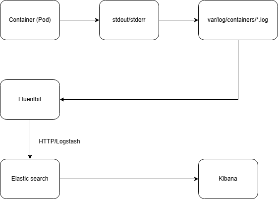

# Báo Cáo Nghiên Cứu và Triển Khai Hệ Thống Log Tập Trung, Log Search trên Kubernetes

## 1. Tổng Quan Kiến Trúc Logging Khuyến Nghị
Kubernetes mặc định không cung cấp giải pháp lưu trữ log lâu dài. Log của ứng dụng thường được container runtime (như containerd) ghi ra file tại đường dẫn `/var/log/pods/` trên từng node. Do đặc tính vòng đời ngắn (ephemeral) của Pod, khi Pod bị xóa hoặc khởi động lại, lượng dữ liệu log cục bộ này sẽ bị mất vĩnh viễn. 

Để tháo gỡ vấn đề này, kiến trúc tiêu chuẩn là triển khai mô hình **Node-level Logging Agent**.
Cơ chế cốt lõi bao gồm:
- Một tiến trình (Agent) dạng DaemonSet sẽ được khởi chạy trên mọi Node thuộc cụm.
- Agent thực thi nhiệm vụ thu thập, tổng hợp toàn bộ log đẩy ra qua kênh `stdout/stderr` từ toàn bộ vùng chứa (container).
- Agent tự động bổ sung siêu dữ liệu (metadata) hữu ích như Tên Pod, Tên Namespace, Nhãn (Labels) gắn kết với từng dòng log.
- Bản ghi cuối cùng được luân chuyển về một hệ thống lưu trữ độc lập (Log Backend) chuyên phục vụ cho mục đích lập chỉ mục, tìm kiếm và phân tích.



## 2. Giải Pháp Quy Hoạch & Thiết Kế
Quá trình khảo sát hiện trạng cụm Kubernetes ghi nhận hệ thống đang vận hành kiến trúc lưu trữ **Elasticsearch** và giao diện tìm kiếm đồ hoạ **Kibana** (thuộc bộ đôi giải pháp ELK) nằm sẵn tại không gian định danh (namespace) `elk`. 

Để bảo toàn mô hình hiện tại, tối ưu tài nguyên và tránh thiết lập hạ tầng lưu trữ trùng lặp, giải pháp lý tưởng là giữ nguyên cụm xử lý Backend và chỉ thiết lập thêm dịch vụ tác tử (Log Agent) gửi nguồn tới đó: **Fluent Bit**.

**Lộ trình xử lý dòng chảy dữ liệu (Log Pipeline):**

```text
  [ Các Node Thuộc Cụm Kubernetes ]
  ┌─────────────────────────────────────────────────────────┐
  │                                                         │
  │  1. Ứng dụng Container (Pod)                            │
  │         │                                               │
  │         ▼ Xuất log thô qua stdout/stderr                │
  │  2. /var/log/containers/*.log                           │
  │         │                                               │
  │         ▼ Đọc file log liên tục (Tail)                  │
  │  3. Tiến trình Fluent Bit (DaemonSet)                   │
  │         │                                               │
  │         ▼ Bổ sung Metadata & Chuyển tiếp (Cổng 9200)    │
  └─────────┼───────────────────────────────────────────────┘
            │ 
            │ (Truyền tải dữ liệu Giao thức HTTP/Logstash)
            │
  [ Namespace: elk - Trung tâm Xử lý backend ]
  ┌─────────▼───────────────────────────────────────────────┐
  │                                                         │
  │  4. Máy chủ Elasticsearch (Lưu trữ và lập chỉ mục)      │
  │         │                                               │
  │         ▼ Hệ thống liên kết phân tích truy vấn nội bộ   │
  │  5. Kibana Dashboard (Giao diện điều khiển đồ hoạ)      │
  │         │                                               │
  └─────────┼───────────────────────────────────────────────┘
            │
            ▼ Cổng Dịch vụ Mạng: 5601
   [ Người Quản Trị / Hệ Thống Giám Sát Khoa Học ]
```
1. **Tiêu thụ (Ingestion):** Fluent Bit DaemonSet tự động định vị và duyệt đọc dữ liệu thô `/var/log/containers/*.log` do Containerd kết xuất.
2. **Tiền xử lý (Processing):** Filter Kubernetes chuyên trách đối chiếu đường dẫn nguồn để gắn nhãn ID ngữ cảnh của K8s lên gói log.
3. **Chuyển tiếp (Forwarding):** Dữ liệu được nén lại và duy trì kết nối truyền tải qua HTTP Bulk Output (cổng `9200`) về máy chủ Elasticsearch phân tán nội mạng Cluster.
4. **Trực quan hoá (Visualization):** Kibana chịu trách nhiệm truy xuất Elastic và biểu thị bảng điều khiển kết quả tương tác bằng đồ thị cho thao tác tìm kiếm tập trung, định tuyến qua cổng dịch vụ nội `5601`.

## 3. Quy Trình Kỹ Thuật: Cài Đặt Hệ Thống

Quá trình triển khai thành phần Agent tuân thủ tiêu chuẩn tự động hóa thông qua hệ thống trình quản lý gói Helm. Yêu cầu định nghĩa trích xuất kết nối từ trước.

### 3.1 Khai Báo Cấu Hình Triển Khai (fluent-bit-values.yaml)
Cần xây dựng tệp `fluent-bit-values.yaml` chứa thông tin đích để bản cài đặt xác định hướng tới máy chủ `elasticsearch-master`. Nội dung tham chiếu như sau:

```yaml
# Định dạng Node-Level Agent

kind: DaemonSet
hostNetwork: true # Cho phép Agent dùng mạng vật lý của Node, tránh bị chặn bởi mạng ảo CNI (Cilium)
dnsPolicy: ClusterFirstWithHostNet # Đảm bảo phân giải tên miền chuẩn khi dùng HostNetwork
config:
  service: |
    [SERVICE]
        Flush         1
        Log_Level     info
        Daemon        off
        Parsers_File  parsers.conf
        HTTP_Server   On
        HTTP_Listen   0.0.0.0
        HTTP_Port     2020
  inputs: |
    [INPUT]
        Name              tail
        Path              /var/log/containers/*.log
        Read_from_Head    On
        Parser            docker
        Tag               kube.*
        Refresh_Interval  5
        Mem_Buf_Limit     50MB
        Skip_Long_Lines   On
  filters: |
    [FILTER]
        Name                kubernetes
        Match               kube.*
        Merge_Log           On
        K8S-Logging.Parser  On
        K8S-Logging.Exclude Off
  outputs: |
    [OUTPUT]
        Name            es
        Match           *
        Host            elasticsearch-master.elk.svc.cluster.local
        Port            9200
        HTTP_User       elastic
        HTTP_Passwd     1qK@B5mQ
        Buffer_Size     False
        Logstash_Format On
        Logstash_Prefix fluent-bit
        Retry_Limit     5
        Trace_Error     On
        Replace_Dots    On
        TLS             On
        TLS.Verify      Off
        Suppress_Type_Name On
rbac:
  create: true
  nodeAccess: true
```

### 3.2 Thực Thi Khởi Tạo Bằng Helm
Bổ sung tệp nhãn của phần mềm Fluent vào máy khách (Client Helm), cập nhật nguồn và thực hiện quá trình gán cấu hình tại namespace đích `elk`:

```bash
# Gán thông tin repo chính thức
helm repo add fluent https://fluent.github.io/helm-charts
helm repo update

# Thực hiện lệnh Install
helm install fluent-bit fluent/fluent-bit \
  --namespace elk \
  -f fluent-bit-values.yaml
```

### 3.3 Giám Sát Và Xác Thực Trạng Thái
Tiến hành rà soát đảm bảo số lượng các tiến trình Pod của Fluent Bit có chu kỳ Ready tương đương với tổng số lượng Node thuộc quản trị của cụm K8s. Yêu cầu kiểm tra qua các tệp nhật ký giám sát hoạt động để phòng ngừa rủi ro tắc nghẽn giao thức khi kết nối mạng.

```bash
# Phục dựng danh sách các luồng tiến trình chạy Fluent Bit
kubectl get pods -n elk -l app.kubernetes.io/name=fluent-bit

# Yêu cầu xuất nhật trình debug từ một tiến trình 
kubectl logs -n elk -l app.kubernetes.io/name=fluent-bit --tail=50
```

## 4. Đặc tả Tiện Ích Giao Diện Tìm Kiếm Log (Log Search via Kibana)

Hệ thống Elasticsearch sau khi thu thập thành công sẽ cho phép thao tác tìm kiếm ngay lập tức mà không cần xử lý thêm.

### 4.1 Xây Dựng Bản Ánh Xạ Dữ Liệu (Data View Configuration)
Yêu cầu thao tác định danh luồng chỉ mục (Index) trên Kibana trước khi khởi động mô-đun tìm kiếm.

1. Khởi chạy cầu kết nối máy chủ tới Local bằng giao thức Port-forward:
`kubectl port-forward svc/kibana-kibana 5601:5601 -n elk`
2. Tiến hành duyệt địa chỉ dịch vụ tại: `http://localhost:5601`.
3. Trong biểu tượng mục lục giao diện, tìm tới chỉ mục hệ thống: **Management** -> **Stack Management**.
4. Chọn danh mục **Data Views** (các ấn bản Kibana thấp hơn được đặt tên **Index Patterns**).
5. Thực hiện tác vụ thiết lập Data View mới, tại khung thuộc tính Index pattern nhập thông số mẫu tương ứng thiết lập giá trị đầu ra Logstash_Prefix: `fluent-bit-*`.
6. Thông số đối chiếu thời gian thiết lập thành chỉ số `@timestamp`.
7. Xác nhận khởi tạo.

### 4.2 Thao Tác Thực Thi Truy Vấn Tìm Kiếm 
Thực hiện quá trình truy vết, sàng lọc dữ liệu đã thu thập:

1. Điều hướng danh mục về chuyên trang chính: **Analytics** -> **Discover**.
2. Kiểm tra bộ chọn ở trên cùng bên trái màn hình đảm bảo luồng đối chiếu trỏ tới Data View `fluent-bit-*` mới thiết lập.
3. Tại trường tham chiếu văn bản ngang màn hình chính, tiến hành rà soát bằng từ khoá trực tiếp hoặc dùng chỉ định KQL (Kibana Query Language). Cú pháp ví dụ nhắm vào cụm ứng dụng Argocd: 
   `kubernetes.labels.app: "argocd"`
4. Tương tác với sơ đồ phổ theo dõi theo biên độ thời gian và chuỗi hành vi log được định dạng.

## 5. Mở Rộng: Triển Khai Phiên Bản Kibana Độc Lập Cho Logging

Nhằm tối ưu quy trình thao tác giám sát mà không làm xáo trộn không gian làm việc (dashboards, data views) với hệ thống Kibana sản phẩm hiện hành, kiến trúc đã được bổ sung giải pháp cấu hình Multi-instance Kibana, kết nối hiển thị song song từ chung một vùng lưu trữ Elasticsearch chuyên biệt.

### 5.1 Xây Dựng Bản Khai Báo Điều Phối (kibana-logging-values.yaml)
Cấu hình tận dụng cơ chế TLS nội bộ sẵn có trong namespace `elk` và tái sử dụng Token định danh (giải pháp khắc phục cơ chế cấm superuser của Elastic 8.x):

```yaml
elasticsearchHosts: "https://elasticsearch-master:9200"

kibanaConfig:
  kibana.yml: |
    elasticsearch.ssl.verificationMode: none

service:
  port: 5601

replicas: 1
```

### 5.2 Khởi Tác Trình Quản Lý Gói (Helm Install)
Để đảm bảo quá trình thiết lập mượt mà, kỹ sư yêu cầu làm sạch môi trường để tránh triệt để lỗi Hook chồng lấp sinh ra bởi thiết lập lỗi trước đó, sau đó triển khai mô-đun mới:

```bash
# Xúc tiến triển khai Kibana phụ trợ (Sử dụng cờ --timeout dự phòng độ trễ khi tải image)
helm install kibana-dung elastic/kibana \
  --namespace elk \
  -f kibana-logging-values.yaml \
  --timeout 10m
```

### 5.3 Mở Cầu Kết Nối Vận Hành Cục Bộ (Port-forward & Cookie Session Clash)
Trong quá trình phát triển trên máy Client, hệ thống trình duyệt web dễ phát sinh lỗi xung đột định danh phiên làm việc (Session Cookie Clash) khi chia sẻ định danh Cookie Kibana của cổng `5601` vào kênh chuyển tiếp `5602` của `localhost`. Quy trình xử lý lỗi tiêu chuẩn:

1. Mở cầu mạng chuyển tiếp qua cổng dịch vụ biệt lập:
   `kubectl port-forward svc/kibana-dung-kibana 5602:5601 -n elk`
2. Yêu cầu **bắt buộc** khởi tạo **Phiên duyệt web Ẩn danh (Incognito Window / Private Browsing)** để cô lập hoàn toàn Cookie cũ.
3. Chuyển đến liên kết vận hành: `http://localhost:5602`
4. Xác thực phân quyền truy cập thông qua tài khoản quản trị cụm ES (`elastic`).
5. Tiến hành lặp lại Quy trình định dạng Data View `fluent-bit-*` (Thuộc mục 4.1) tại không gian Kibana mới này để hoàn thiện 100% dòng lưu chuyển Log.
