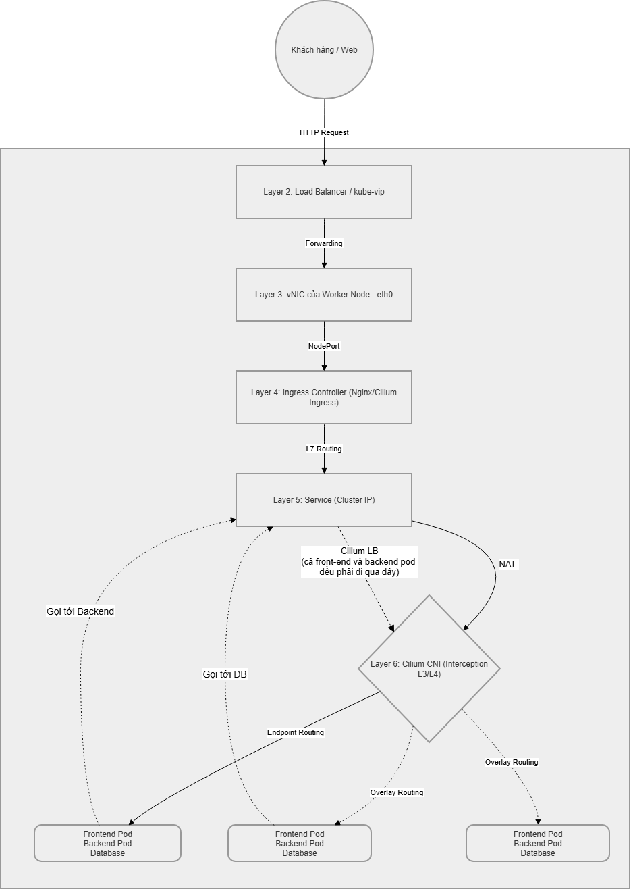

# Báo cáo Thực tế: Kiến trúc HA, Core Concepts và Network Topology trong Kube Api Server/K8s

*(Tài liệu này giải thích lý thuyết dựa trên trích dẫn Docs chuẩn của Kubernetes (K8s) và kèm theo các lệnh (`kubectl`) để công ty trực tiếp kiểm chứng trên Cụm K8s chạy RKE2 thực tế.)*

---

---

## 1. Cơ chế HA (High Availability) cho Kube API Server / Control Plane
Để đảm bảo cụm Kubernetes luôn đạt tính sẵn sàng cao, hệ thống hiện tại đang triển khai các cơ chế sau:

### 1.1. Multiple Control-Plane Nodes (Chống điểm lỗi đơn)
Cụm được thiết kế với **3 node Control-Plane** (Master nodes) hoạt động song song. Việc ghép nhiều node control-plane giúp loại bỏ hoàn toàn điểm lỗi đơn (SPOF - Single Point of Failure).
> 📖 **Trích dẫn từ K8s Docs (Stacked etcd topology):**
> *"Each control plane node runs an instance of the kube-apiserver, kube-scheduler, and kube-controller-manager. The kube-apiserver is exposed to worker nodes using a load balancer."* ([Link](https://kubernetes.io/docs/setup/production-environment/tools/kubeadm/ha-topology/#stacked-etcd-topology))

> 💡 **Lệnh kiểm chứng thực tế:**
> ```bash
> kubectl get nodes -l node-role.kubernetes.io/control-plane=true -o wide
> ```
> **Kết quả thực tế:**
> ```text
> NAME   STATUS   ROLES                       AGE   VERSION          INTERNAL-IP   EXTERNAL-IP   OS-IMAGE             KERNEL-VERSION     CONTAINER-RUNTIME
> cp01   Ready    control-plane,etcd,master   50d   v1.33.6+rke2r1   172.18.0.51   <none>        Ubuntu 24.04.3 LTS   6.8.0-90-generic   containerd://2.1.5-k3s1
> cp02   Ready    control-plane,etcd,master   50d   v1.33.6+rke2r1   172.18.0.52   <none>        Ubuntu 24.04.3 LTS   6.8.0-90-generic   containerd://2.1.5-k3s1
> cp03   Ready    control-plane,etcd,master   50d   v1.33.6+rke2r1   172.18.0.53   <none>        Ubuntu 24.04.3 LTS   6.8.0-90-generic   containerd://2.1.5-k3s1
> ```

### 1.2. Cụm etcd phân tán (Stacked etcd) và Cơ chế Quorum
RKE2 cấu hình cơ sở dữ liệu `etcd` chạy ngầm trực tiếp trên 3 node Control-Plane này.
etcd sử dụng thuật toán đồng thuận **Raft**. Để cụm ra quyết định an toàn và tránh hội chứng phân liệt (Split-brain), hệ thống luôn yêu cầu được cài đặt với số lượng lẻ (3, 5, 7) để đạt được sự đồng thuận quá bán (Quorum).
> 📖 **Trích dẫn từ K8s Docs (Operating etcd clusters for Kubernetes):**
> *"etcd is a leader-based distributed system. Ensure that the leader periodically send heartbeats on time to all followers to keep the cluster stable. You should run etcd as a cluster with an odd number of members."* ([Link](https://kubernetes.io/docs/tasks/administer-cluster/configure-upgrade-etcd/))

> 💡 **Lệnh kiểm chứng thực tế (Xem các pod etcd đang chạy):**
> ```bash
> kubectl get pods -n kube-system -l component=etcd -o wide
> ```
> **Kết quả thực tế:**
> ```text
> NAME        READY   STATUS    RESTARTS   AGE   IP            NODE   NOMINATED NODE   READINESS GATES
> etcd-cp01   1/1     Running   0          50d   172.18.0.51   cp01   <none>           <none>
> etcd-cp02   1/1     Running   0          50d   172.18.0.52   cp02   <none>           <none>
> etcd-cp03   1/1     Running   0          50d   172.18.0.53   cp03   <none>           <none>
> ```

### 1.3. Cân bằng tải cho API Server (Load Balancing) & Daemonset Proxy
* **Mức ngoại vi:** Hiện đang dùng `kube-vip` để cấp một VIP (Virtual IP) độ sẵn sàng cao trực tiếp cho cụm API Server.
* **Mức nội bộ (Daemonset Proxy RKE2):** Nếu một worker node cần gọi lên API server, ngầm định RKE2 agent trên các Worker Node sẽ phân tải request xoay vòng (Round-robin) đến thẳng cả 3 node Master. 

---

## 2. Các Core Concepts (Khái niệm cốt lõi cần làm rõ)

### 2.1. CoreDNS
Là máy chủ phân giải tên miền (DNS) tiêu chuẩn của cụm Kubernetes. CoreDNS giúp Service và Pod giao tiếp với nhau bằng Domain Name thay vì địa chỉ IP biến động.

#### A. Cách cấu hình (Corefile)
CoreDNS được cấu hình thông qua một file gọi là **Corefile**, được lưu dưới dạng `ConfigMap` trong namespace `kube-system`. Corefile sử dụng kiến trúc **Plugins** để xử lý các truy vấn:

| Plugin | Chức năng |
|---|---|
| **`kubernetes`** | Plugin lõi, theo dõi API Server để tạo bản ghi DNS cho Service và Pod. |
| **`forward`** | Chuyển tiếp các yêu cầu ra DNS ngoài (như 8.8.8.8) nếu không tìm thấy trong cụm. |
| **`cache`** | Lưu kết quả truy vấn vào bộ nhớ đệm để giảm độ trễ. |
| **`reload`** | Tự động cập nhật cấu hình ngay khi ConfigMap thay đổi. |

> 💡 **Cấu hình Corefile thực tế lấy từ cụm của công ty:**
> ```text
> .:53 {
>     errors
>     health { lameduck 10s }
>     ready
>     kubernetes cluster.local cluster.local in-addr.arpa ip6.arpa {
>         pods insecure
>         fallthrough in-addr.arpa ip6.arpa
>         ttl 30
>     }
>     prometheus 0.0.0.0:9153
>     forward . /etc/resolv.conf
>     cache 30
>     loop
>     reload
>     loadbalance
> }
> ```

#### B. Cách sử dụng thực tế (Ví dụ từ cụm của công ty)
Dựa trên các Service đang chạy thực tế trong cụm của công ty, đây là cách công ty gọi chúng từ bên trong một Pod:

1.  **Gọi Service mặc định (Namespace: `default`):** `kubernetes` hoặc `kubernetes.default.svc.cluster.local`
2.  **Gọi Service hệ thống (Namespace: `kube-system`):** `rke2-coredns-rke2-coredns.kube-system`
3.  **Gọi Service ứng dụng (Namespace: `sonobuoy`):** `sonobuoy-aggregator.sonobuoy`

**Tính tự động hóa:** Khi công ty tạo bất kỳ Service nào mới, CoreDNS sẽ **ngay lập tức** tạo ra tên miền tương ứng mà không cần công ty sửa bất kỳ file cấu hình nào.

### 2.2. CIDR Network (Dải mạng Cluster và Service)
- **Pod CIDR:** Đây là một Dải IP mạng ảo (Virtual IP Pool) cấp định tuyến nội bộ, sau đó cắt nhỏ (Subnet routing) để gán IP cho các Pods (thường dải `10.42.0.0/16` hoặc `10.100.0.0/16`).
- **Service CIDR:** Dải pool cấp riêng để thiết lập IP Ảo (ClusterIP / VIP) cho các Services làm nhiệm vụ cân bằng tải cục bộ.
- 🚨 *Lưu ý sống còn:* Các dải IP này tuyệt đối **KHÔNG ĐƯỢC PHÉP CHỒNG LẤN (OVERLAP)** với mạng LAN vật lý của Công ty.
> 📖 **Trích dẫn từ K8s Docs (Cluster Networking):**
> *"Kubernetes clusters require to allocate non-overlapping IP addresses for Pods, Services and Nodes, from a range of available addresses configured in the following components:"* ([Link](https://kubernetes.io/docs/concepts/cluster-administration/networking/))

> 💡 **Thông tin thực tế trong cụm của công ty:**
> - **Pod CIDR:** Cụm đang sử dụng dải **`10.100.0.0/16`**. Mỗi Node được cấp một dải con `/24` (Ví dụ: `10.100.0.0/24`, `10.100.1.0/24`...) để gán IP cho các Pod chạy trên đó.
> - **Service CIDR:** Cụm đang sử dụng dải **`10.101.0.0/16`**. IP của dịch vụ CoreDNS (`10.101.0.10`) và Service hệ thống (`10.101.0.1`) đều nằm trong dải này.

> ```bash
> # Xem dải IP Pod (PodCIDR) cấp cho từng Node
> kubectl get nodes -o custom-columns="NAME:.metadata.name,POD-CIDR:.spec.podCIDR"
> 
> # Xem IP của Service mặc định "kubernetes" để xác định dải Service CIDR
> kubectl get svc kubernetes -o jsonpath='{.spec.clusterIP}'
> ```
> **Kết quả thực tế:**
> ```text
> NAME   POD-CIDR
> cp01   10.100.0.0/24
> cp02   10.100.1.0/24
> cp03   10.100.2.0/24
> wk01   10.100.4.0/24
> wk02   10.100.3.0/24
> wk03   10.100.5.0/24
> 
> Service ClusterIP: 10.101.0.1
> ```

### 2.3. CNI Plugin (Container Network Interface)
Là tiêu chuẩn xử lý chuyện gán IP động cho container (IPAM) và thiết lập đường hầm ảo (Overlay Network / Route) để kết nối các Pods sinh ra ở các Node vật lý khác nhau. Cụm của công ty đang sử dụng plugin phần thứ 3 tên là **Cilium**.
> 📖 **Trích dẫn từ K8s Docs (Network Plugins):**
> *"Kubernetes (version 1.3 through to the latest 1.35, and likely onwards) lets you use Container Network Interface (CNI) plugins for cluster networking. You must use a CNI plugin that is compatible with your cluster and that suits your needs. [...] A CNI plugin is required to implement the Kubernetes network model."* ([Link](https://kubernetes.io/docs/concepts/extend-kubernetes/compute-storage-net/network-plugins/))

> 💡 **Thông tin thực tế trong cụm của công ty:**
> Cụm đang chạy **Cilium** dưới dạng `DaemonSet` trên cả 6 node (3 Master, 3 Worker). Cilium sử dụng eBPF để xử lý mạng thay vì iptables truyền thống, giúp đạt hiệu suất cực cao.
> - **Namespace:** `kube-system`
> - **Trạng thái:** Toàn bộ 6/6 Pod Cilium đều đang `Running`.

> 💡 **Lệnh kiểm chứng (Kiểm tra Cilium đang chạy phân tán trên toàn cụm):**
> ```bash
> # Kiểm tra trạng thái DaemonSet Cilium
> kubectl get ds -n kube-system -l k8s-app=cilium
> 
> # Kiểm tra chi tiết IP và Node mà các Pod Cilium đang chiếm giữ
> kubectl get pods -n kube-system -l k8s-app=cilium -o wide
> ```
> **Kết quả thực tế:**
> ```text
> NAME     DESIRED   CURRENT   READY   UP-TO-DATE   AVAILABLE   NODE SELECTOR            AGE
> cilium   6         6         6       6            6           kubernetes.io/os=linux   50d
> 
> NAME           READY   STATUS    RESTARTS   AGE   IP            NODE   NOMINATED NODE   READINESS GATES
> cilium-4qqbf   1/1     Running   0          50d   172.18.0.51   cp01   <none>           <none>
> cilium-7dqkx   1/1     Running   0          50d   172.18.0.61   wk01   <none>           <none>
> cilium-ftr8g   1/1     Running   0          50d   172.18.0.53   cp03   <none>           <none>
> cilium-p9q9t   1/1     Running   0          50d   172.18.0.52   cp02   <none>           <none>
> cilium-sjdhc   1/1     Running   0          50d   172.18.0.63   wk03   <none>           <none>
> cilium-zh4zh   1/1     Running   0          50d   172.18.0.62   wk02   <none>           <none>
> ```

---

## 3. Network Topology (Sơ đồ mạng tổng quát)

Sơ đồ dưới đây mô phỏng kiến trúc mạng của cụm (Kèm CNI Cilium và RKE2 kube-vip).



### 3.1. Giải thích chi tiết các luồng dữ liệu (Flows)

#### A. Luồng từ ngoài vào (North-South - Nét liền)
1.  **Chốt chặn Ingress:** Chỉ có **Frontend Service** được phơi bày ra ngoài thông qua Ingress. **Backend** và **Database** được để ở dạng **ClusterIP** (chỉ nội bộ), giúp tăng cường bảo mật.
2.  **Cơ chế Service-to-Endpoints:** Một Service (ví dụ Frontend) sẽ đại diện cho một nhóm các Pod nằm trên các Node khác nhau.
3.  **Điều phối thông minh (Cilium LB):** Khi traffic chạm vào Service, Cilium sẽ ưu tiên đẩy vào Pod nằm cùng Node (Local Routing) để tối ưu tốc độ. Nếu Pod đó gặp sự cố, nó sẽ tự động đổi sang các Pod ở Node khác thông qua **Overlay Routing**.

#### B. Luồng nội bộ (East-West - Nét đứt)
*   Giao tiếp ngang giữa các Microservices (VD: Frontend gọi Backend, hoặc Backend gọi Database) được kiểm soát bởi **Cilium Network Policy**.
*   Dù các Pod nằm chung một Node vật lý, chúng vẫn phải đi qua Cilium để được kiểm tra định danh trước khi dữ liệu được truyền đi.

> [!IMPORTANT]
> **Lưu ý về Bảo mật (Network Policy):**
> Mặc dù về mặt mạng, mọi Pod đều có thể gọi nhau, nhưng với Cilium, chúng ta áp dụng **Cilium Network Policy** để chặn các luồng ngược (như Database gọi ngược lên Backend). Điều này đảm bảo hacker không thể dùng Database làm bàn đạp để tấn công sâu hơn vào hệ thống.

**Chú thích sơ đồ:**
*   **Cilium LB:** Là "Bộ não" quyết định chọn Pod đích (Logic).
*   **Overlay Routing:** Là "Con đường" vận chuyển gói tin xuyên qua các Node vật lý (Hạ tầng).
*   **North-South Traffic:** Luồng dọc (Dữ liệu người dùng từ ngoài vào).
*   **East-West Traffic:** Luồng ngang (Dữ liệu nội bộ giữa các microservices).
