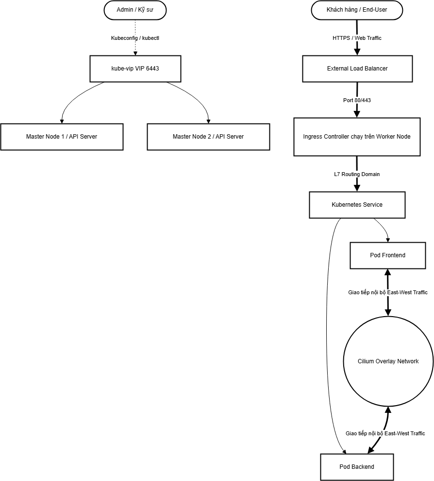

# Báo cáo Thực tế: Kiến trúc HA, Core Concepts và Network Topology trong RKE/K8s

*(Tài liệu này giải thích lý thuyết dựa trên trích dẫn Docs chuẩn của Kubernetes (K8s) và kèm theo các lệnh (`kubectl`) để công ty trực tiếp kiểm chứng trên Cụm K8s chạy RKE2 thực tế.)*

---

## 0. RKE và RKE2 là gì?
Trước khi đi vào chi tiết kỹ thuật, ta cần hiểu về nền tảng đang chạy:

*   **RKE (Rancher Kubernetes Engine):** Là một bộ phân phối Kubernetes (K8s distribution) gọn nhẹ, đạt chuẩn CNCF, được Rancher Labs phát triển. Đặc điểm lớn nhất của RKE đời đầu là chạy toàn bộ các thành phần K8s (apiserver, etcd...) bên trong các Docker container.
*   **RKE2 (RKE Government):** Đây là phiên bản kế thừa của RKE và cũng chính là phiên bản mà **cụm của công ty đang sử dụng** (`v1.33.6+rke2r1`).
    *   **Bản chất cài đặt:** RKE2 **không tự nhiên có sẵn** hay được tích hợp mặc định vào hệ điều hành (như Ubuntu). Nó là một **bộ cài đặt (Installer)** hoặc **bộ phân phối (Distribution)** mà quản trị viên phải tải về và chạy trên từng Node. Sau khi chạy, RKE2 sẽ tự động tải các "nguyên liệu" (container image) cần thiết để "nấu" thành một cụm Kubernetes hoàn chỉnh.
    *   **Bảo mật vượt trội:** RKE2 được thiết kế tập trung vào tính bảo mật và tuân thủ các tiêu chuẩn chính phủ (như FIPS 140-2).
    *   **Không phụ thuộc Docker:** Khác với RKE, RKE2 sử dụng `containerd` trực tiếp thay vì Docker, giúp giảm bớt các lớp trung gian không cần thiết.
    *   **Kế thừa từ K3s:** RKE2 lấy những ưu điểm về sự đơn giản, dễ cài đặt của K3s nhưng lại tối ưu cho các hệ thống Enterprise (Doanh nghiệp lớn) cần độ tin cậy và bảo mật cao.

---

## 1. Cơ chế HA (High Availability) cho Kube API Server / Control Plane
Để đảm bảo cụm Kubernetes luôn đạt tính sẵn sàng cao, hệ thống hiện tại đang triển khai các cơ chế sau:

### 1.1. Multiple Control-Plane Nodes (Chống điểm lỗi đơn)
Cụm được thiết kế với **3 node Control-Plane** (Master nodes) hoạt động song song. Việc ghép nhiều node control-plane giúp loại bỏ hoàn toàn điểm lỗi đơn (SPOF - Single Point of Failure).
> 📖 **Trích dẫn từ K8s Docs (Stacked etcd topology):**
> *"Each control plane node runs an instance of the kube-apiserver, kube-scheduler, and kube-controller-manager. The kube-apiserver is exposed to worker nodes using a load balancer."* ([Link](https://kubernetes.io/docs/setup/production-environment/tools/kubeadm/ha-topology/#stacked-etcd-topology))

> 💡 **Lệnh kiểm chứng thực tế:**
> ```bash
> kubectl get nodes -l node-role.kubernetes.io/control-plane=true -o wide
> ```

### 1.2. Cụm etcd phân tán (Stacked etcd) và Cơ chế Quorum
RKE2 cấu hình cơ sở dữ liệu `etcd` chạy ngầm trực tiếp trên 3 node Control-Plane này.
etcd sử dụng thuật toán đồng thuận **Raft**. Để cụm ra quyết định an toàn và tránh hội chứng phân liệt (Split-brain), hệ thống luôn yêu cầu được cài đặt với số lượng lẻ (3, 5, 7) để đạt được sự đồng thuận quá bán (Quorum).
> 📖 **Trích dẫn từ K8s Docs (Operating etcd clusters for Kubernetes):**
> *"etcd is a leader-based distributed system. Ensure that the leader periodically send heartbeats on time to all followers to keep the cluster stable. You should run etcd as a cluster with an odd number of members."* ([Link](https://kubernetes.io/docs/tasks/administer-cluster/configure-upgrade-etcd/))

> 💡 **Lệnh kiểm chứng thực tế (Xem các pod etcd đang chạy):**
> ```bash
> kubectl get pods -n kube-system -l component=etcd -o wide
> ```

### 1.3. Cân bằng tải cho API Server (Load Balancing) & Daemonset Proxy
* **Mức ngoại vi:** Hiện đang dùng `kube-vip` để cấp một VIP (Virtual IP) độ sẵn sàng cao trực tiếp cho cụm API Server.
* **Mức nội bộ (Daemonset Proxy RKE2):** Nếu một worker node cần gọi lên API server, ngầm định RKE2 agent trên các Worker Node sẽ phân tải request xoay vòng (Round-robin) đến thẳng cả 3 node Master. 

---

## 2. Các Core Concepts (Khái niệm cốt lõi cần làm rõ)

### 2.1. CoreDNS
Là máy chủ phân giải tên miền (DNS) gắn liền của cụm Kubernetes. CoreDNS giúp Service và Pod giao tiếp với nhau bằng Domain Name (VD: `service-name.namespace.svc.cluster.local`) thay vì dùng địa chỉ IP.
> 📖 **Trích dẫn từ K8s Docs (DNS for Services and Pods):**
> *"Kubernetes publishes information about Pods and Services which is used to program DNS. kubelet configures Pods' DNS so that running containers can look up Services by name rather than IP. Services defined in the cluster are assigned DNS names. By default, a client Pod's DNS search list includes the Pod's own namespace and the cluster's default domain."* ([Link](https://kubernetes.io/docs/concepts/services-networking/dns-pod-service/))

> 💡 **Thông tin thực tế trong cụm của công ty:**
> Hiện tại, cụm đang chạy **2 Pod CoreDNS** để đảm bảo High Availability (HA) theo cơ chế ReplicaSet và 1 Pod Autoscaler, cùng cấp phát IP Dịch vụ (`ClusterIP`) là `10.101.0.10` ra toàn cụm K8s. Cụ thể:
> 
> | Tên Pod (Namespace: kube-system) | Trạng thái | IP Thực tế | Node Đang Chạy |
> |---|---|---|---|
> | `rke2-coredns-rke2-coredns-85d6696775-865ss` | Running | `10.100.0.193` | `cp01` |
> | `rke2-coredns-rke2-coredns-85d6696775-jcgrc` | Running | `10.100.1.193` | `cp02` |
> | `rke2-coredns-rke2-coredns-autoscaler-665b...`| Running | `10.100.0.171` | `cp01` |

> 💡 **Lệnh kiểm chứng:**
> ```bash
> # Xem danh sách Pod CoreDNS gắn liền IP và Node
> kubectl get pods -n kube-system -l k8s-app=kube-dns -o wide
> ```

### 2.2. CIDR Network (Dải mạng Cluster và Service)
- **Pod CIDR:** Đây là một Dải IP mạng ảo (Virtual IP Pool) cấp định tuyến nội bộ, sau đó cắt nhỏ (Subnet routing) để gán IP cho các Pods (thường dải `10.42.0.0/16` hoặc `10.100.0.0/16`).
- **Service CIDR:** Dải pool cấp riêng để thiết lập IP Ảo (ClusterIP / VIP) cho các Services làm nhiệm vụ cân bằng tải cục bộ.
- 🚨 *Lưu ý sống còn:* Các dải IP này tuyệt đối **KHÔNG ĐƯỢC PHÉP CHỒNG LẤN (OVERLAP)** với mạng LAN vật lý của Công ty.
> 📖 **Trích dẫn từ K8s Docs (Cluster Networking):**
> *"Kubernetes clusters require to allocate non-overlapping IP addresses for Pods, Services and Nodes, from a range of available addresses configured in the following components:"* ([Link](https://kubernetes.io/docs/concepts/cluster-administration/networking/))

> 💡 **Thông tin thực tế trong cụm của công ty:**
> - **Pod CIDR:** Cụm đang sử dụng dải **`10.100.0.0/16`**. Mỗi Node được cấp một dải con `/24` (Ví dụ: `10.100.0.0/24`, `10.100.1.0/24`...) để gán IP cho các Pod chạy trên đó.
> - **Service CIDR:** Cụm đang sử dụng dải **`10.101.0.0/16`**. IP của dịch vụ CoreDNS (`10.101.0.10`) và Service hệ thống (`10.101.0.1`) đều nằm trong dải này.

> 💡 **Lệnh kiểm chứng mạng CIDR thực tế:**
> ```bash
> # Xem dải IP Pod (PodCIDR) cấp cho từng Node
> kubectl get nodes -o custom-columns="NAME:.metadata.name,POD-CIDR:.spec.podCIDR"
> 
> # Xem IP của Service mặc định "kubernetes" để xác định dải Service CIDR
> kubectl get svc kubernetes -o jsonpath='{.spec.clusterIP}'
> ```

### 2.3. CNI Plugin (Container Network Interface)
Là tiêu chuẩn xử lý chuyện gán IP động cho container (IPAM) và thiết lập đường hầm ảo (Overlay Network / Route) để kết nối các Pods sinh ra ở các Node vật lý khác nhau. Cụm của công ty đang sử dụng plugin phần thứ 3 tên là **Cilium**.
> 📖 **Trích dẫn từ K8s Docs (Network Plugins):**
> *"Kubernetes (version 1.3 through to the latest 1.35, and likely onwards) lets you use Container Network Interface (CNI) plugins for cluster networking. You must use a CNI plugin that is compatible with your cluster and that suits your needs. [...] A CNI plugin is required to implement the Kubernetes network model."* ([Link](https://kubernetes.io/docs/concepts/extend-kubernetes/compute-storage-net/network-plugins/))

> 💡 **Thông tin thực tế trong cụm của công ty:**
> Cụm đang chạy **Cilium** dưới dạng `DaemonSet` trên cả 6 node (3 Master, 3 Worker). Cilium sử dụng eBPF để xử lý mạng thay vì iptables truyền thống, giúp đạt hiệu suất cực cao.
> - **Namespace:** `kube-system`
> - **Trạng thái:** Toàn bộ 6/6 Pod Cilium đều đang `Running`.

> 💡 **Lệnh kiểm chứng (Kiểm tra Cilium đang chạy phân tán trên toàn cụm):**
> ```bash
> # Kiểm tra trạng thái DaemonSet Cilium
> kubectl get ds -n kube-system -l k8s-app=cilium
> 
> # Kiểm tra chi tiết IP và Node mà các Pod Cilium đang chiếm giữ
> kubectl get pods -n kube-system -l k8s-app=cilium -o wide
> ```

---

## 3. Network Topology (Sơ đồ mạng tổng quát)

Sơ đồ kết nối mạng tiêu chuẩn phân tách rõ luồng giao thông **Bắc-Nam (North-South)** và **Đông-Tây (East-West)** trong kiến trúc Cluster của công ty (Kèm CNI Cilium và RKE2 kube-vip).



**Chú thích luồng mạng:**
*   **North-South Traffic (Luồng Bắc-Nam - Dọc):** Người dùng từ ngoài Internet truy cập vào ứng dụng thông qua Load Balancer và Ingress Controller để đẩy traffic xuống Pod. Hoặc Quản trị viên truy cập vào API Server thông qua `kube-vip`. Control Plane (Master Node) KHÔNG xử lý traffic của người dùng cuối.
*   **East-West Traffic (Luồng Đông-Tây - Ngang):** Giao tiếp nội bộ giữa các Pod với nhau (VD: Frontend gọi Backend). Giao tiếp này chạy ngầm bên dưới thông qua mạng ảo Overlay Network do CNI Cilium thiết lập.

---

