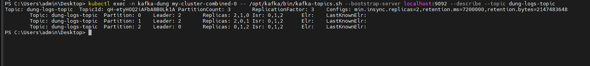
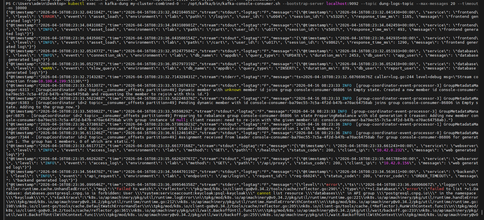
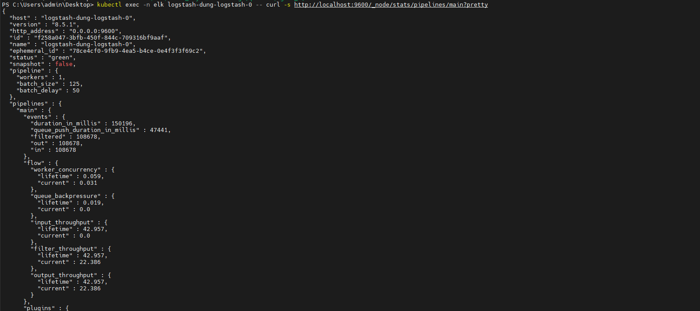
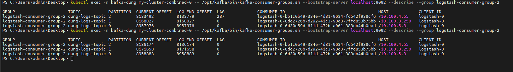
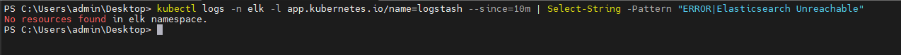

# How To Check

## 1. Mục tiêu

File này hướng dẫn cách tự kiểm tra toàn bộ hệ thống logging đã triển khai, để xác nhận có thỏa mãn các yêu cầu:

1. Có hệ thống K8s sinh log gồm `fe`, `be`, `db`, `web`
2. Có quản lý vòng đời lưu trữ bằng ILM
3. Có index design riêng
4. Có mapping tĩnh, không dùng dynamic
5. Có buffer của Fluent Bit
6. Có alert theo số lượng error trong một khoảng thời gian

Các bước dưới đây chia làm 2 nhóm:

- test bằng terminal
- test bằng giao diện Kibana

---

## 2. Kiểm tra workload sinh log trong namespace `dung-lab`

### 2.1. Kiểm tra namespace

```powershell
kubectl get ns dung-lab
```

Kết quả mong đợi:

- có namespace `dung-lab`
- trạng thái `Active`

### 2.2. Kiểm tra 4 deployment

```powershell
kubectl get deploy -n dung-lab
```

Kết quả mong đợi:

- có 4 deployment:
  - `dung-fe-log-generator`
  - `dung-be-log-generator`
  - `dung-db-log-generator`
  - `dung-web-log-generator`
- cột `READY` là `1/1`

### 2.3. Kiểm tra các pod sinh log (HA) và phân bổ Node

```powershell
kubectl get pods -n dung-lab -o wide
```

Kết quả mong đợi:

- có 12 pod (vì mỗi dịch vụ fe, be, web, db đều đã tăng Replicas lên 3)
- tất cả `Running`
- không có pod `CrashLoopBackOff`
- **Các pod cùng loại (như 3 pod FE) không được nằm chung trên 1 Node** (Kiểm tra cột `NODE` chạy rải đều trên `wk01`, `wk02`, `wk03` do đã cấu hình `podAntiAffinity`).

### 2.4. Kiểm tra log thực tế từng pod

```powershell
kubectl logs -n dung-lab deployment/dung-fe-log-generator --tail=10
kubectl logs -n dung-lab deployment/dung-be-log-generator --tail=10
kubectl logs -n dung-lab deployment/dung-db-log-generator --tail=10
kubectl logs -n dung-lab deployment/dung-web-log-generator --tail=10
```

Kết quả mong đợi:

- mỗi pod đều in log JSON
- có các field như:
  - `@timestamp`
  - `service`
  - `level`
  - `event`
  - `message`

Ví dụ:

```json
{
  "@timestamp": "2026-04-03T03:39:16.427001+00:00",
  "service": "frontend",
  "level": "INFO",
  "event": "page_view",
  "message": "frontend generated log"
}
```

Nếu bước này đúng, tức là yêu cầu số 1 đã đạt ở mức nguồn sinh log.

---

## 3. Kiểm tra Fluent Bit đã đọc log toàn cluster (ưu tiên `dung-lab`)

### 3.1. Kiểm tra pod Fluent Bit

```powershell
kubectl get pods -n elk -l app.kubernetes.io/name=fluent-bit
```

Kết quả mong đợi:

- có 3 pod Fluent Bit
- tất cả `Running`

### 3.2. Kiểm tra rollout của DaemonSet

```powershell
kubectl rollout status daemonset/fluent-bit -n elk
```

Kết quả mong đợi:

- thông báo rollout thành công

### 3.3. Kiểm tra log Fluent Bit

```powershell
kubectl logs -n elk -l app.kubernetes.io/name=fluent-bit --tail=100
```

Kết quả mong đợi:

- không có lỗi config parser
- không có lỗi crash
- có log kiểu:
  - `storage_strategy='filesystem'`
  - `worker #0 started`
  - `worker #1 started`

Nếu thấy dòng kiểu:

```text
storage_strategy='filesystem'
```

thì điều đó xác nhận buffer filesystem đã bật.

### 3.4. Kiểm tra ConfigMap Fluent Bit đang dùng

```powershell
kubectl get configmap fluent-bit -n elk -o yaml
```

Tìm các điểm sau trong `fluent-bit.conf`:

- parser `json_log`
- `storage.path /var/fluent-bit/state`
- `storage.type filesystem`
- `Path /var/log/containers/*.log` (đọc toàn cluster)
- output `kafka` tới topic `dung-logs-topic`

Nếu có đủ các mục trên, tức là yêu cầu số 3, 4, 5 đã được cấu hình đúng ở phía Fluent Bit.

---

## 4. Kiểm tra index design trong Elasticsearch

### 4.1. Kiểm tra index riêng

```powershell
kubectl exec -n elk elasticsearch-master-0 -- curl -sk -u elastic: "https://localhost:9200/_cat/indices/dung-*?v"
```

Kết quả mong đợi:

- có 4 index:
  - `dung-fe-000001`
  - `dung-be-000001`
  - `dung-db-000001`
  - `dung-web-000001`

Đây là bằng chứng yêu cầu số 3 đã đạt.

### 4.2. Kiểm tra alias ghi

```powershell
kubectl exec -n elk elasticsearch-master-0 -- curl -sk -u elastic:1qK@B5mQ "https://localhost:9200/_cat/aliases/dung-*?v"
```

Kết quả mong đợi:

- có alias:
  - `dung-fe-write`
  - `dung-be-write`
  - `dung-db-write`
  - `dung-web-write`
- `is_write_index` là `true`

### 4.3. Kiểm tra log đã đi vào index riêng chưa

```powershell
kubectl exec -n elk elasticsearch-master-0 -- curl -sk -u elastic:1qK@B5mQ "https://localhost:9200/dung-fe-*/_search?q=*&size=2&sort=@timestamp:desc"
kubectl exec -n elk elasticsearch-master-0 -- curl -sk -u elastic:1qK@B5mQ "https://localhost:9200/dung-be-*/_search?q=*&size=2&sort=@timestamp:desc"
kubectl exec -n elk elasticsearch-master-0 -- curl -sk -u elastic:1qK@B5mQ "https://localhost:9200/dung-db-*/_search?q=*&size=2&sort=@timestamp:desc"
kubectl exec -n elk elasticsearch-master-0 -- curl -sk -u elastic:1qK@B5mQ "https://localhost:9200/dung-web-*/_search?q=*&size=2&sort=@timestamp:desc"
```

Kết quả mong đợi:

- mỗi index đều có document
- field JSON đã được parse ra riêng, không còn chỉ nằm trong chuỗi log thô

Ví dụ ở `dung-be-*` bạn phải thấy field như:

- `service`
- `level`
- `endpoint`
- `status_code`
- `error_code`

Nếu thấy các field đó ở `_source`, thì parser và routing đang chạy đúng.

---

## 5. Kiểm tra mapping tĩnh

### 5.1. Kiểm tra template

```powershell
kubectl exec -n elk elasticsearch-master-0 -- curl -sk -u elastic:1qK@B5mQ "https://localhost:9200/_index_template/dung-fe-template"
kubectl exec -n elk elasticsearch-master-0 -- curl -sk -u elastic:1qK@B5mQ "https://localhost:9200/_index_template/dung-be-template"
kubectl exec -n elk elasticsearch-master-0 -- curl -sk -u elastic:1qK@B5mQ "https://localhost:9200/_index_template/dung-db-template"
kubectl exec -n elk elasticsearch-master-0 -- curl -sk -u elastic:1qK@B5mQ "https://localhost:9200/_index_template/dung-web-template"
```

Kết quả mong đợi:

- mỗi template tồn tại
- có `"dynamic": false`

### 5.2. Kiểm tra mapping của index thật

```powershell
kubectl exec -n elk elasticsearch-master-0 -- curl -sk -u elastic:1qK@B5mQ "https://localhost:9200/dung-be-000001/_mapping"
```

Kết quả mong đợi:

- thấy kiểu field cụ thể, ví dụ:
  - `status_code` là `integer`
  - `service` là `keyword`
  - `message` là `text`

Nếu có điều này, thì yêu cầu số 4 đã đạt.

---

## 6. Kiểm tra ILM

### 6.1. Kiểm tra policy

```powershell
kubectl exec -n elk-dung elasticsearch-master-0 -- curl -sk -u elastic:1xNIfTEXaH0MsbQN "https://localhost:9200/_ilm/policy/logs-lab-policy"
```

Kết quả mong đợi:

- policy tồn tại
- có phase `hot`
- có phase `delete`

### 6.2. Kiểm tra index đã gắn ILM chưa

```powershell
kubectl exec -n elk elasticsearch-master-0 -- curl -sk -u elastic:1qK@B5mQ "https://localhost:9200/dung-fe-000001/_ilm/explain"
kubectl exec -n elk elasticsearch-master-0 -- curl -sk -u elastic:1qK@B5mQ "https://localhost:9200/dung-be-000001/_ilm/explain"

kubectl exec -n elk elasticsearch-master-0 -- curl -sk -u elastic:1qK@B5mQ "https://localhost:9200/_ilm/policy/logs-lab-policy?pretty"
```

Kết quả mong đợi:

- `"managed": true`
- `"policy": "logs-lab-policy"`
- `"phase": "hot"`

Nếu có đủ, yêu cầu số 2 đã đạt.

---

## 7. Kiểm tra buffer Fluent Bit

### 7.1. Kiểm tra cấu hình buffer

```powershell
kubectl get configmap fluent-bit -n elk -o yaml
```

Tìm trong cấu hình:

- `storage.path /var/fluent-bit/state`
- `storage.type filesystem`
- `DB /var/fluent-bit/state/tail-db`
- `Mem_Buf_Limit`
- `storage.total_limit_size`

### 7.2. Kiểm tra volume mount

```powershell
kubectl get ds fluent-bit -n elk -o yaml
```

Tìm trong DaemonSet:

- mount `/var/fluent-bit/state`
- `hostPath` cho `fluent-bit-state`

### 7.3. Kiểm tra pod đang dùng filesystem buffer

```powershell
kubectl logs -n elk -l app.kubernetes.io/name=fluent-bit --tail=100
```

Kết quả mong đợi:

- có dòng:

```text
storage_strategy='filesystem'
```

### 7.4. Kiểm tra file state trong pod Fluent Bit

Lấy tên một pod:

```powershell
kubectl get pods -n elk -l app.kubernetes.io/name=fluent-bit
```

Sau đó:

```powershell
kubectl exec -n elk <ten-pod-fluent-bit> -- ls -la /var/fluent-bit/state
```

Kết quả mong đợi:

- có file như:
  - `tail-db`
  - file chunk/state khác

Nếu có, yêu cầu số 5 đã đạt.

### 7.5. Test mạnh hơn cho buffer

Chỉ làm nếu bạn được phép test trên cụm.

Ý tưởng:

1. để 4 pod `dung-lab` tiếp tục sinh log
2. quan sát log Fluent Bit khi Elasticsearch bị quá tải hoặc tạm lỗi
3. kiểm tra Fluent Bit không crash mà retry

Hiện tại trên cụm đã quan sát được thực tế:

- Fluent Bit có retry khi Elasticsearch trả `429`
- agent vẫn chạy
- buffer filesystem vẫn bật

Đây đã là bằng chứng khá tốt cho cơ chế buffer/retry.

---

## 8. Kiểm tra alert bằng ElastAlert

### 8.1. Kiểm tra deployment ElastAlert

```powershell
kubectl get deploy -n elk elastalert2
kubectl get pods -n elk -l app=elastalert2
```

Kết quả mong đợi:

- deployment tồn tại
- pod `Running`

### 8.2. Kiểm tra log khởi động

```powershell
kubectl logs -n elk deployment/elastalert2 --tail=100
```

Kết quả mong đợi:

- có dòng:
  - `3 rules loaded`
  - `Starting up`

### 8.3. Kiểm tra alert đã bắn thật chưa

```powershell
kubectl logs -n elk deployment/elastalert2 --tail=200
```

Kết quả mong đợi:

- có log cảnh báo cho:
  - `Backend Error Count Alert`
  - `Database Auth Failed Alert`
  - `Nginx 5xx Error Alert`

Ví dụ bạn sẽ thấy kiểu:

```text
Alert for Backend Error Count Alert
Alert for Database Auth Failed Alert
Alert for Nginx 5xx Error Alert
```

Nếu thấy các dòng này thì yêu cầu số 6 đã đạt.

---

## 9. Kiểm tra trên giao diện Kibana

### 9.1. Mở Kibana

Nếu bạn dùng Kibana riêng cho logging:

```powershell
kubectl port-forward svc/kibana-dung-kibana 5602:5601 -n elk
```

Sau đó mở:

```text
http://localhost:5602
```

Khuyến nghị:

- mở tab ẩn danh để tránh clash cookie

### 9.2. Tạo Data View cho các index mới

Vào:

- `Stack Management`
- `Data Views`

Tạo lần lượt:

- `dung-fe-*`
- `dung-be-*`
- `dung-db-*`
- `dung-web-*`

Chọn timestamp field:

- `@timestamp`

### 9.3. Kiểm tra log frontend

Vào:

- `Analytics`
- `Discover`

Chọn Data View:

- `dung-fe-*`

Kết quả mong đợi:

- thấy log frontend
- có các cột như:
  - `service`
  - `level`
  - `path`  
  - `user_id`
  - `response_time_ms`

### 9.4. Kiểm tra log backend

Chọn Data View:

- `dung-be-*`

Kết quả mong đợi:

- thấy log backend
- có field:
  - `endpoint`
  - `status_code`
  - `error_code`

### 9.5. Kiểm tra log database

Chọn Data View:

- `dung-db-*`

Kết quả mong đợi:

- thấy log database
- có field:
  - `db_name`
  - `query_type`
  - `duration_ms`
  - `db_user`

### 9.6. Kiểm tra log webserver

Chọn Data View:

- `dung-web-*`

Kết quả mong đợi:

- thấy log webserver
- có field:
  - `method`
  - `status_code`
  - `client_ip`

### 9.7. Kiểm tra filter theo namespace

Trong Discover, thử query:

```text
kubernetes.namespace_name: "dung-lab"
```

Kết quả mong đợi:

- chỉ hiện log của lab bạn

### 9.8. Kiểm tra log lỗi

Ví dụ trong `dung-be-*`, query:

```text
level: "ERROR"
```

Trong `dung-web-*`, query:

```text
status_code >= 500
```

Trong `dung-db-*`, query:

```text
event: "auth_failed"
```

Nếu ra kết quả đúng, thì parser và mapping đang hoạt động tốt.

---

## 10. Kiểm tra High Availability (HA) bổ sung

Do hệ thống đã được cấu trúc nâng cao lên chuẩn HA, bạn cần nghiệm thu thêm các tiêu chí phân tán tải sau:

### 10.1. Kiểm tra HA của Kibana UI
Sử dụng lệnh theo dõi sự phân bổ của Kibana:
```powershell
kubectl get pods -n elk -l release=kibana-dung -o wide
```
Kết quả mong đợi:
- Có 3 pod Kibana hiển thị `Running` và `1/1 READY`.
- Nhìn vào cột `NODE`, các pod phải chạy rải rác trên 3 máy tính vật lý khác nhau (ví dụ: `wk01`, `wk02`, `wk03`).

### 10.2. Kiểm tra HA của dữ liệu Elasticsearch (Replicas Index)
Thực hiện truy vấn qua curl để xem số lượng bản sao dự phòng của log:
```powershell
kubectl exec -n elk elasticsearch-master-0 -- curl -sk -u elastic:1qK@B5mQ "https://localhost:9200/_cat/indices/dung-*?v"
```
Kết quả mong đợi:
- Nhìn vào cột **`rep`** (replicas). Chỉ số này phải hiển thị là `1` thay vì `0`. Điều này chứng tỏ dữ liệu của từng file log đã được sao lưu dự phòng sang máy vật lý thứ 2 bên trong kho Elasticsearch.

---

## 11. Checklist xác nhận theo yêu cầu

### Yêu cầu 1: Có hệ thống K8s sinh log FE/BE/DB/WEB

Check:

- `kubectl get pods -n dung-lab`
- `kubectl logs` từng deployment

Đạt khi:

- có đủ 4 pod
- log sinh đều

### Yêu cầu 2: Có lifecycle cho Elasticsearch

Check:

- `_ilm/policy/logs-lab-policy`
- `_ilm/explain`

Đạt khi:

- có policy
- index được quản lý bởi ILM

### Yêu cầu 3: Có index design

Check:

- `_cat/indices/dung-*`
- `_cat/aliases/dung-*`

Đạt khi:

- có index riêng cho FE/BE/DB/WEB

### Yêu cầu 4: Có mapping, không dùng dynamic

Check:

- `_index_template/dung-*-template`
- `_mapping`

Đạt khi:

- `"dynamic": false`
- field có kiểu rõ ràng

### Yêu cầu 5: Có buffer của Fluent Bit

Check:

- ConfigMap Fluent Bit
- DaemonSet volume mount
- log Fluent Bit có `storage_strategy='filesystem'`

Đạt khi:

- filesystem buffer đang bật

### Yêu cầu 6: Có alert theo error count

Check:

- `kubectl logs -n elk deployment/elastalert2`

Đạt khi:

- thấy alert thật trong log ElastAlert

---

## 12. Bộ lệnh ngắn gọn để kiểm tra nhanh

```powershell
kubectl get pods -n dung-lab
kubectl logs -n dung-lab deployment/dung-fe-log-generator --tail=5
kubectl logs -n dung-lab deployment/dung-be-log-generator --tail=5
kubectl get pods -n elk -l app.kubernetes.io/name=fluent-bit
kubectl logs -n elk deployment/elastalert2 --tail=50
kubectl exec -n elk elasticsearch-master-0 -- curl -sk -u elastic:1qK@B5mQ "https://localhost:9200/_cat/indices/dung-*?v"
kubectl exec -n elk elasticsearch-master-0 -- curl -sk -u elastic:1qK@B5mQ "https://localhost:9200/_cat/aliases/dung-*?v"
kubectl exec -n elk elasticsearch-master-0 -- curl -sk -u elastic:1qK@B5mQ "https://localhost:9200/_ilm/policy/logs-lab-policy?pretty"
```

### 14.6 - Check các pod nhanh (Tất cả namespace liên quan)
```powershell
kubectl get pod -n kafka-dung -o wide ; kubectl get pod -n dung-lab -o wide ; kubectl get pod -n elk -o wide
```

---

## 15. Tổng kết quy trình kiểm tra (Quick Summary)

Nếu bạn muốn kiểm tra nhanh "Sức khỏe" của toàn bộ Pipeline, hãy chạy 3 lệnh này:

1. **Kafka Health**: `kubectl exec -n kafka-dung my-cluster-combined-0 -- /opt/kafka/bin/kafka-topics.sh --bootstrap-server localhost:9092 --describe --topic dung-logs-topic` (Đảm bảo ISR đủ 3).


2. **Logstash Lag**: `kubectl exec -n kafka-dung my-cluster-combined-0 -- /opt/kafka/bin/kafka-consumer-groups.sh --bootstrap-server localhost:9092 --describe --group logstash-consumer-group-2` (Đảm bảo LAG thấp).


3. **ES Ingest**: `kubectl exec -n elk elasticsearch-master-0 -- curl -sk -u elastic:1qK@B5mQ "https://localhost:9200/dung-*/_count?q=@timestamp:%5Bnow-5m%20TO%20now%5D&pretty"` (Đảm bảo có log mới trong 5 phút qua).

---

## 16. Kết luận

Nếu bạn làm hết các bước kiểm tra trong file này và thấy kết quả đúng như mong đợi, thì có thể kết luận rằng hệ thống logging hiện tại đã đáp ứng được các yêu cầu bạn đặt ra ở mức triển khai thực tế trên cụm.

Điểm quan trọng nhất để xác nhận nhanh là:

- `dung-lab` có đủ các pod sinh log và chạy rải đều trên các Node.
- Log đi vào đúng partition của Kafka và được Logstash tiêu thụ với độ trễ (LAG) tối thiểu.
- Log được Logstash xử lý, gán đúng `service` và đẩy vào các index `dung-fe|be|db|web-*`.
- ILM và Mapping tĩnh hoạt động chính xác cho các index này.
- Hệ thống có khả năng chịu lỗi (HA) ở mọi tầng: 3 Log generator, 3 Fluent Bit, 3 Kafka Brokers, 3 Logstash, 3 Elasticsearch master/data.

---

## 14. Kiểm tra luồng Fluent Bit -> Kafka -> Logstash -> Elasticsearch (E2E)

Mục tiêu của mục này là xác nhận 4 tầng trong pipeline đang hoạt động trơn tru:

1. Fluent Bit đọc log từ `dung-lab` và đẩy vào Kafka.
2. Kafka nhận được message có trường `service`.
3. Logstash consume topic và route theo `service`.
4. Elasticsearch nhận document mới trong 15 phút gần nhất.

Nên chạy theo đúng thứ tự bên dưới.

### 14.1. Tầng Fluent Bit

```powershell
# Kiểm tra pod Fluent Bit trên các node
kubectl get pods -n elk -l app.kubernetes.io/name=fluent-bit -o wide

# Kiểm tra rollout DaemonSet
kubectl rollout status daemonset/fluent-bit -n elk

# Kiểm tra config thực tế đang chạy (không chỉ file local)
kubectl get configmap fluent-bit -n elk -o jsonpath='{.data.fluent-bit\.conf}'

# Kiểm tra log 5 phút gần nhất của Fluent Bit
kubectl logs -n elk -l app.kubernetes.io/name=fluent-bit --since=5m --tail=120
```

Chú thích nhanh:
- `READY` phải là `1/1`, `STATUS` là `Running`.
- Trong config phải thấy:
  - `Path /var/log/containers/*.log`
  - `Key_Name     log`
  - output `kafka` tới topic `dung-logs-topic`.
- Nếu log có lỗi parser/output liên tục thì tầng Fluent Bit chưa ổn.

### 14.2. Tầng Kafka

#### A. Kiểm tra sức khỏe Cluster và Topic
```powershell
# Kiểm tra trạng thái các node Kafka (KRaft)
kubectl get pods -n kafka-dung -l strimzi.io/name=my-cluster-kafka

# Kiểm tra metadata của topic (Xác nhận có đủ 3 replicas và ISR ổn định)
kubectl exec -n kafka-dung my-cluster-combined-0 -- /opt/kafka/bin/kafka-topics.sh --bootstrap-server localhost:9092 --describe --topic dung-logs-topic
```
Kiểm tra metadata của topic (Xác nhận có đủ 3 replicas và ISR ổn định)


#### B. Kiểm tra luồng dữ liệu thực tế
```powershell
# Đọc nhanh 20 message để xem dữ liệu có vào topic không
kubectl exec -n kafka-dung my-cluster-combined-0 -- /opt/kafka/bin/kafka-console-consumer.sh --bootstrap-server localhost:9092 --topic dung-logs-topic --max-messages 20 --timeout-ms 10000

# Lọc riêng message frontend (có thể đổi frontend -> backend/database/webserver)
kubectl exec -n kafka-dung my-cluster-combined-0 -- /opt/kafka/bin/kafka-console-consumer.sh --bootstrap-server localhost:9092 --topic dung-logs-topic --max-messages 300 --timeout-ms 15000 | Select-String -Pattern '"service"\s*:\s*"frontend"'
```
Đọc nhanh 20 message để xem dữ liệu có vào topic không


Chú thích nhanh:
- Lệnh `--describe` phải cho thấy `ReplicationFactor: 3` và `Isr` gồm đủ 3 node (0,1,2).
- Trong message nên thấy JSON app nằm trong field `message` (hoặc đã được parse) và có `"service": "frontend|backend|database|webserver"`.
- Nếu đọc được message nhưng không thấy `service`, khả năng parse/routing ở tầng sau sẽ sai.

### 14.3. Tầng Logstash

#### A. Kiểm tra trạng thái Pod và Pipeline
```powershell
# Kiểm tra pod Logstash hiện tại (đang chạy 1 replica)
kubectl get pods -n elk-dung -l app=logstash-dung-logstash -o wide

# Kiểm tra log khởi động - Tìm dòng "Successfully started Kafka consumer"
kubectl logs -n elk-dung logstash-dung-logstash-0 --since=1h | Select-String -Pattern "Successfully started Kafka consumer"

# Kiem tra runtime pipeline (events in/out, throughput) cua pod 0
kubectl exec -n elk-dung logstash-dung-logstash-0 -- curl -s http://localhost:9600/_node/stats/pipelines/main?pretty

```
Kiểm tra runtime pipeline của pod 0


#### B. Kiểm tra Consumer Group Lag (Cực kỳ quan trọng)
```powershell
# Kiểm tra xem Logstash có đang tiêu thụ log kịp không, hay bị tồn đọng (LAG)
kubectl exec -n kafka-dung my-cluster-combined-0 -- /opt/kafka/bin/kafka-consumer-groups.sh --bootstrap-server localhost:9092 --describe --group logstash-consumer-group-2

```
Kiểm tra xem Logstash có đang tiêu thụ log kịp không, hay bị tồn đọng (LAG)


#### C. Lọc nhanh lỗi kết nối ES
```powershell
kubectl logs -n elk-dung -l app.kubernetes.io/name=logstash --since=10m | Select-String -Pattern "ERROR|Elasticsearch Unreachable"
```
Lọc nhanh lỗi kết nối ES


Chú thích nhanh:
- Pod Logstash phải `Running`, restart thấp.
- `LAG` lý tưởng là `0` hoặc con số nhỏ ổn định. Nếu `LAG` tăng liên tục, Logstash đang bị nghẽn (có thể do ES chậm hoặc Resource Limit quá thấp).
- Group ID `logstash-consumer-group-2` phải khớp với cấu hình trong `logstash-values.yaml`.

### 14.4. Tầng Elasticsearch (Xác nhận Ingest)

#### A. Kiểm tra số lượng log mới (Ingest Rate)
```powershell
# Count trong 15 phút gần nhất cho từng nhóm index (nếu > 0 là OK)
kubectl exec -n elk-dung elasticsearch-master-0 -- curl -sk -u elastic:1xNIfTEXaH0MsbQN "https://localhost:9200/dung-fe-*/_count?q=@timestamp:%5Bnow-15m%20TO%20now%5D&pretty"
kubectl exec -n elk-dung elasticsearch-master-0 -- curl -sk -u elastic:1xNIfTEXaH0MsbQN "https://localhost:9200/dung-be-*/_count?q=@timestamp:%5Bnow-15m%20TO%20now%5D&pretty"
kubectl exec -n elk-dung elasticsearch-master-0 -- curl -sk -u elastic:1xNIfTEXaH0MsbQN "https://localhost:9200/dung-db-*/_count?q=@timestamp:%5Bnow-15m%20TO%20now%5D&pretty"
kubectl exec -n elk-dung elasticsearch-master-0 -- curl -sk -u elastic:1xNIfTEXaH0MsbQN "https://localhost:9200/dung-web-*/_count?q=@timestamp:%5Bnow-15m%20TO%20now%5D&pretty"
```

#### B. Chẩn đoán khi không thấy log trong `dung-*`
Nếu `dung-*` không có log mới, hãy kiểm tra xem log có bị đẩy vào index "rác" (fallback) do sai lệch field `service` không:
```powershell
# 1) Kiểm tra xem log có rơi vào index "khác" của lab không
kubectl exec -n elk-dung elasticsearch-master-0 -- curl -sk -u elastic:1xNIfTEXaH0MsbQN "https://localhost:9200/dung-lab-khac-*/_count?q=@timestamp:%5Bnow-15m%20TO%20now%5D&pretty"

# 2) Kiểm tra xem log có rơi vào index cluster chung không
kubectl exec -n elk-dung elasticsearch-master-0 -- curl -sk -u elastic:1xNIfTEXaH0MsbQN "https://localhost:9200/cluster-khac-*/_count?q=kubernetes.namespace_name:dung-lab%20AND%20@timestamp:%5Bnow-15m%20TO%20now%5D&pretty"
```

Chú thích nhanh:
- `count > 0` trong `now-15m` là dấu hiệu ingest đang realtime.
- Nếu `cluster-khac-*` có log của `dung-lab`, hãy kiểm tra lại cấu hình `filter` trong Logstash (đặc biệt là phần normalize field `service`).

Chú thích nhanh:
- `count > 0` trong `now-15m` là dấu hiệu ingest đang realtime.
- `@timestamp` của document mới nhất phải tiệm cận thời gian hiện tại.
- Nếu `count = 0` nhưng `_search sort=@timestamp:desc` vẫn có dữ liệu mới hơn, cần kiểm tra lại múi giờ/time range trên Kibana.
- Nếu Kafka `LAG` đang cao (hàng chục nghìn), có thể tạm kiểm tra `now-30m` hoặc `now-60m` thay cho `now-15m` trong lúc Logstash đang catch-up.
- Nếu `cluster-khac-*` vẫn tăng đều nhưng `dung-fe|be|db|web-*` đứng yên, khả năng cao đang lệch điều kiện route theo namespace/service ở Logstash.

### 14.5. Checklist kết luận nhanh

Đạt `PASS` cho luồng E2E nếu thỏa cả 4 điều kiện:

1. Fluent Bit pod `Running` và config output Kafka đúng topic.
2. Kafka đọc được message có trường `service`.
3. Logstash consumer group có `LAG` thấp và không có lỗi kết nối ES.
4. ES `dung-fe|be|db|web-*` có `count > 0` trong 15 phút gần nhất.

Nếu fail:
- Fail ở 1 hoặc 2: khoanh vùng Fluent Bit/Kafka.
- Fail ở 3: khoanh vùng Logstash.
- Fail ở 4: khoanh vùng route/output sang Elasticsearch.

### 14.6 - Check các pod
```bash
k get pod -n kafka-dung -o wide ; k get pod -n dung-lab -o wide ; k get pod -n elk -o wide

```