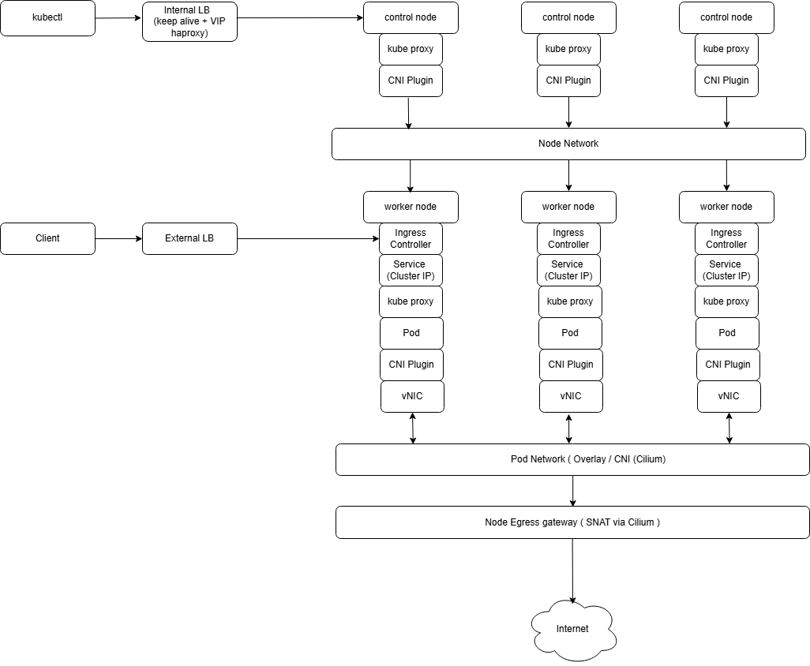

# Kiến trúc và Luồng Topology Mạng trong Kubernetes

Dưới đây là sơ đồ Topology mạng của hệ thống cụm Kubernetes:

## Giải thích luồng hoạt động mạng (Network Flow Topology)

Sơ đồ trên thể hiện các luồng mạng chính trong cụm Kubernetes: Luồng quản trị (từ Admin), Luồng truy cập ứng dụng (từ Client), các tầng giao tiếp nội bộ và Luồng đi ra ngoài (Egress tới Internet). Cụ thể như sau:

### 1. Luồng truy cập quản trị (Admin / Kubectl Flow)
- **Nguồn:** Quản trị viên sử dụng công cụ lệnh `kubectl` để gửi các yêu cầu tương tác với Kubernetes API.
- **Internal Load Balancer (LB):** Yêu cầu được gửi đến Cluster thông qua một Internal LB. LB này sử dụng Keepalived kết hợp Virtual IP (VIP) và HAProxy nhằm đảm bảo tính sẵn sàng cao (High Availability) cho Control Plane.
- **Control Nodes:** Điểm đến tiếp theo là các `control node`. Internal LB điều phối, phân bổ lưu lượng API đều đặn tới các máy chủ Control Plane, tránh tình trạng quá tải cục bộ và duy trì hiệu suất vận hành của cụm thông qua mạng lưới chung (**Node Network**).

### 2. Luồng truy cập của người dùng cuối (Client / Ingress Flow)
- **Nguồn:** Người dùng đầu cuối (`Client`) truy cập các dịch vụ và ứng dụng được lưu trữ trong cụm.
- **External Load Balancer (LB):** Yêu cầu từ ngoài Internet hoặc mạng nội bộ được tiếp nhận và cân bằng tải bởi `External LB` trước khi đẩy vào Worker Nodes.
- **Worker Nodes & Ingress:** Traffic lọt vào các `worker node` bằng cách đi qua `Ingress Controller` – giữ vai trò kiểm soát luồng truy cập HTTP/HTTPS, định tuyến theo tên miền (Host) hoặc đường dẫn (Path).
- **Service & Định tuyến nội bộ:** Từ Ingress Controller, yêu cầu được chuyển hướng tới `Service` nội bộ của cụm (loại `Cluster IP`). Lúc này, `kube-proxy` hỗ trợ chuyển đổi Service logic tới các `Pod` đích cụ thể đang thực thi ứng dụng.
- Giao diện mạng ảo (`vNIC`) do `CNI Plugin` cung cấp sẽ nhận luồng dữ liệu cuối cùng và đưa vào bên trong các hệ thống Container.

### 3. Các tầng mạng kiến trúc nội bộ
- **Node Network (Mạng Underlay):** Là tầng mạng cơ sở (vật lý hoặc máy ảo) liên kết trực tiếp Control Nodes và Worker Nodes. Đóng vai trò xương sống cho việc duy trì trạng thái của cụm.
- **Pod Network (Mạng Overlay / CNI Cilium):** Mạng lớp ảo hóa do `CNI Plugin` (ở đây sử dụng Cilium) quản lý. Mạng này cho phép bất kỳ `Pod` nào cũng có định danh IP nội bộ riêng biệt và có thể giao tiếp thông suốt với các Pod khác bất kể chúng đang nằm trên Node nào.

### 4. Luồng truy cập từ cụm ra bên ngoài (Egress Traffic)
- Khi các `Pod` có tác vụ cần lấy dữ liệu hoặc gọi API từ máy chủ bên ngoài hệ thống cụm.
- Tuyến dữ liệu sẽ xuất phát từ **Pod Network**, liên kết với điểm egress ở hệ thống.
- Chức năng **Node Egress gateway**: Hệ thống thực hiện dịch chuyển địa chỉ mạng nguồn (**SNAT** - Source NAT) thông qua Cilium. Address IP ảo của Pod sẽ được ánh xạ thành IP thật của Node nhằm đảm bảo định tuyến hợp lệ ra hệ thống **Internet**, phục vụ việc tải thông tin và đưa gói dữ liệu phản hồi ngược lại về đúng Pod.
